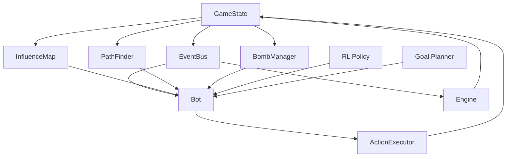
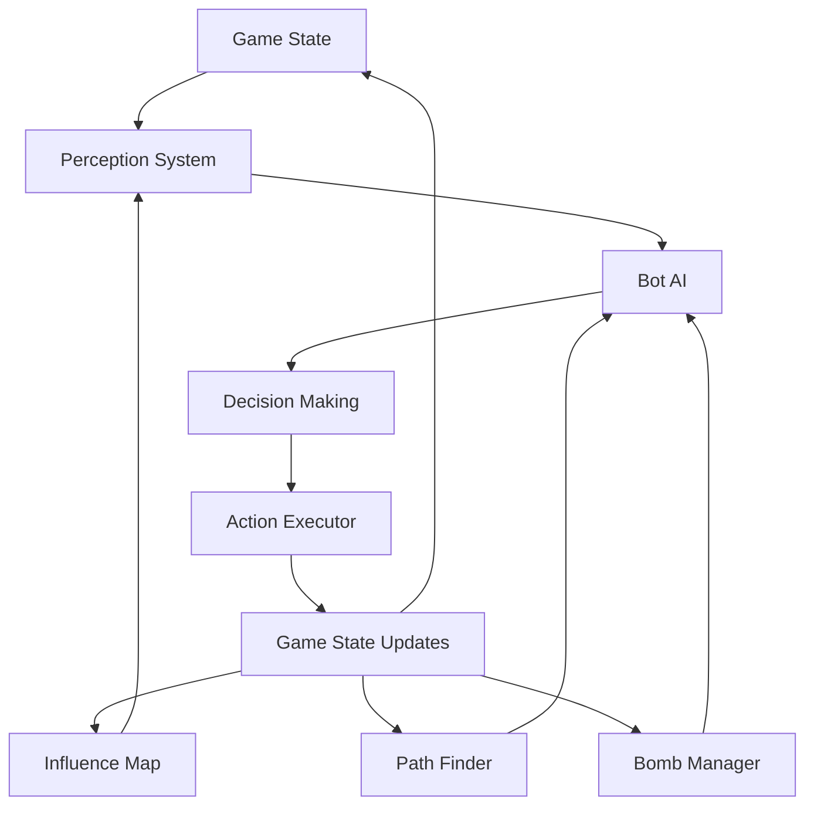
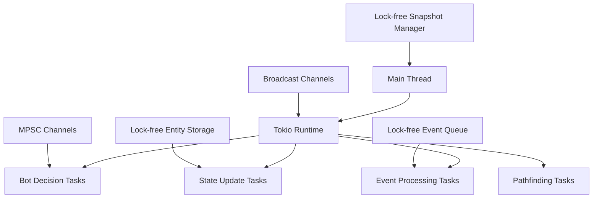
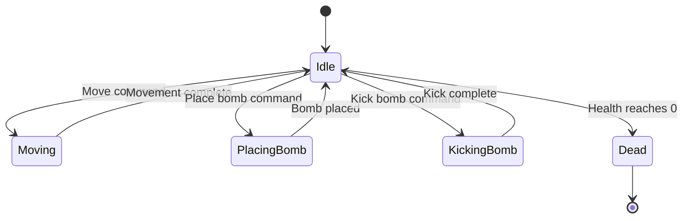

## 1.9 Diagrams and Visualizations

### Component Interaction Diagram



### Data Flow Diagram



### Memory Layout Diagram

```
+------------------------+
|       GameState        |
+------------------------+
| - tick: u64            |
| - rng: StdRng          |
| - grid: Grid           |
| - entities: EntityStorage |
| - version: AtomicU64   |
+------------------------+

+------------------------+
|         Grid           |
+------------------------+
| - width: u16           |
| - height: u16          |
| - cells: [Cell]        |
+------------------------+

+------------------------+
|         Cell           |
+------------------------+
| - flags: CellFlags     |
| - entity_ids: [Option<EntityId>; 4] |
| - danger: u8           |
| - reserved: u8         |
+------------------------+
```

### Concurrency Model Diagram



### Performance Critical Path Diagram

```mermaid
gantt
    title Performance Critical Path
    dateFormat  sss
    section Bot Decision Loop
    Perception Update       :a1, 0, 200
    Influence Query         :a2, after a1, 100
    Pathfinding            :a3, after a2, 300
    Goal Evaluation        :a4, after a3, 150
    Decision Making        :a5, after a4, 200
    Action Execution       :a6, after a5, 50
    
    section State Update
    Event Processing       :b1, 0, 150
    Bomb Updates           :b2, after b1, 100
    Influence Updates      :b3, after b2, 200
    Entity Updates         :b4, after b3, 100
```



### State Machine Diagrams



