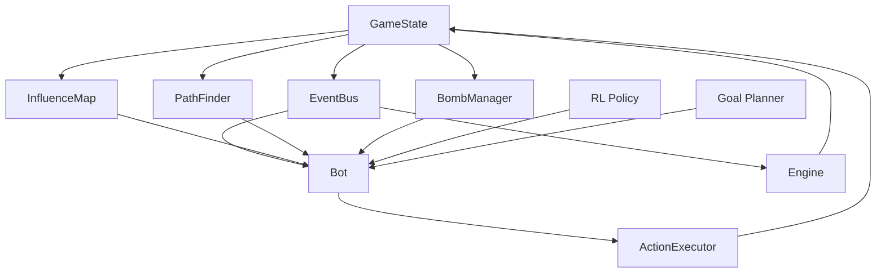
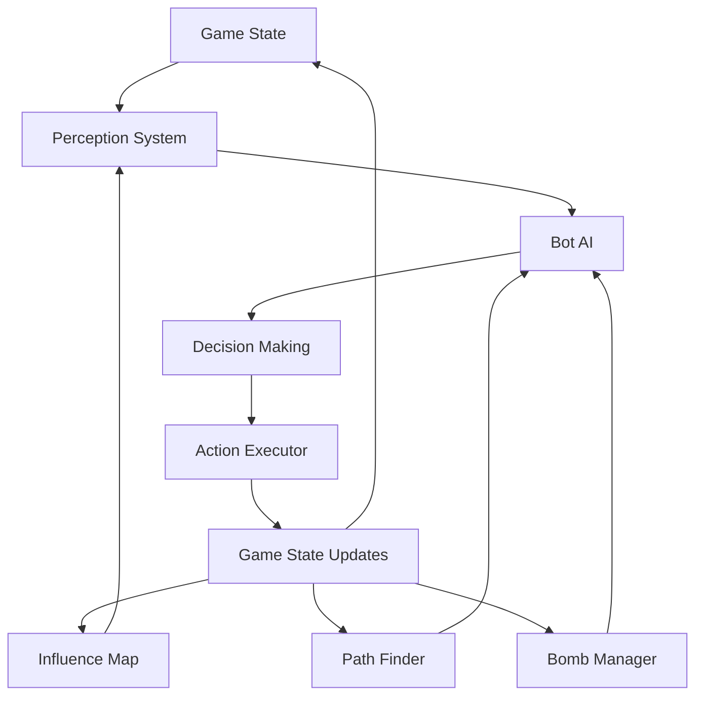
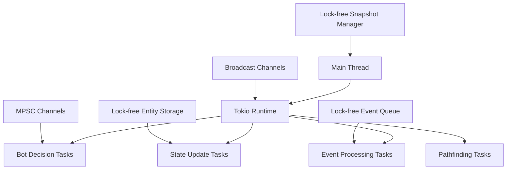
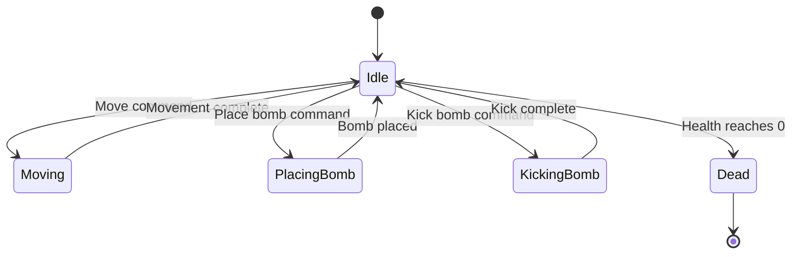

```markdown
# Low-Level Design Document for Bomberman Rust Tournament

## 1.1 Executive Summary

This document provides a comprehensive low-level design for the Bomberman Rust Tournament project, a high-performance AI agent system for a Bomberman-inspired game. The design is based on the high-level architecture in `Docs/Architecture.md` and follows the crate structure defined there, using `docs/example/example_crate` as a template for individual crate designs.

### Key Design Decisions and Trade-offs

1. **Modular Architecture**: The system is divided into 10 specialized crates, each with a single responsibility. This enhances maintainability but requires careful interface design to avoid performance bottlenecks.

2. **Performance-First Approach**: All design decisions prioritize meeting the strict performance requirements (≤ 1 ms median decision time per bot). This leads to more complex implementations in some areas but is necessary for the target use case.

3. **Lock-Free Concurrency**: The system uses lock-free data structures and atomic operations to minimize contention, which improves performance but increases implementation complexity.

4. **Memory Efficiency**: With a 16 MB limit per bot, the design emphasizes memory pooling, zero-copy techniques, and cache-friendly data layouts.

5. **Deterministic Simulation**: The system ensures bit-identical replays through careful state management and seeded RNG, which slightly constrains some implementation choices.

### Implementation Roadmap with Phases

**Phase 1: Foundation (Weeks 1-4)**
- Implement core state management and engine crates
- Establish basic event system
- Create test utilities and benchmarking framework

**Phase 2: Game Mechanics (Weeks 5-8)**
- Implement bombs and pathfinding crates
- Develop basic influence map system
- Create initial bot decision-making framework

**Phase 3: AI Systems (Weeks 9-12)**
- Complete influence map and goal management systems
- Implement advanced pathfinding algorithms
- Develop bot kernel with heuristic AI

**Phase 4: Reinforcement Learning (Weeks 13-16)**
- Implement RL crate with policy and value estimation
- Create gym-compatible environment
- Develop transition recording and replay buffers

**Phase 5: Optimization and Testing (Weeks 17-20)**
- Performance optimization of critical paths
- Comprehensive testing and validation
- Documentation and CI/CD pipeline refinement

## 1.2 Crate-Level Detailed Design

### State Crate (`bomberman_state`)

#### Module Structure
```
bomberman_state/
├── lib.rs                 // Crate public interface
├── state/                 // Core state management
│   ├── mod.rs
│   ├── game_state.rs      // Main game state structure
│   ├── entity.rs          // Entity definitions and storage
│   └── snapshot.rs        // State snapshot management
├── grid/                  // Spatial grid management
│   ├── mod.rs
│   ├── grid.rs            // Grid data structure
│   ├── cell.rs            // Cell types and states
│   └── iterator.rs        // Grid iteration patterns
├── components/            // Entity components
│   ├── mod.rs
│   ├── position.rs        // Position component
│   ├── bomb.rs            // Bomb component
│   ├── player.rs          // Player component
│   └── destructible.rs    // Destructible wall component
├── serialization/         // State serialization
│   ├── mod.rs
│   ├── encoder.rs         // State encoding
│   └── decoder.rs         // State decoding
└── tests/                 // Unit and integration tests
    ├── mod.rs
    ├── state_tests.rs
    └── serialization_tests.rs
```

#### Core Data Structures

```rust
// Main game state structure
pub struct GameState {
    tick: u64,
    rng: StdRng,
    grid: Grid,
    entities: EntityStorage,
    version: AtomicU64,
    snapshots: SnapshotManager,
}

// Entity storage with archetype-based ECS
pub struct EntityStorage {
    entities: SlotMap<EntityId, EntityLocation>,
    archetypes: HashMap<ArchetypeId, Archetype>,
    component_indices: HashMap<ComponentId, usize>,
}

// Grid representation optimized for cache locality
pub struct Grid {
    width: u16,
    height: u16,
    cells: Box<[Cell]>,
    spatial_index: SpatialHashMap,
}

// Cell representation with packed data for efficiency
#[repr(C, packed)]
pub struct Cell {
    flags: CellFlags,
    entity_ids: [Option<EntityId>; 4], // Limited entities per cell
    danger: u8,                        // Danger level for influence maps
    reserved: u8,                     // Padding for alignment
}

// Entity identifier with generation for safety
#[derive(Debug, Clone, Copy, PartialEq, Eq, Hash)]
pub struct EntityId {
    index: u32,
    generation: u32,
}

// Position component with grid coordinates
#[derive(Debug, Clone, Copy)]
pub struct Position {
    x: u16,
    y: u16,
    subpixel_x: u8,  // For smooth movement
    subpixel_y: u8,
}

// Bomb component with timing and properties
#[derive(Debug, Clone)]
pub struct Bomb {
    owner: EntityId,
    timer: u8,
    power: u8,
    pierce: bool,
    remote: bool,
}

// Player component with bot-specific data
#[derive(Debug, Clone)]
pub struct Player {
    bot_id: BotId,
    health: u8,
    power: u8,
    speed: u8,
    bomb_count: u8,
    max_bombs: u8,
    kick: bool,
    punch: bool,
}
```

#### Key Algorithms

1. **State Delta Application**
   - Apply deltas in batch to minimize cache misses
   - Use dirty flags to identify changed regions
   - Parallelize independent updates where possible

```rust
impl GameState {
    pub fn apply_deltas(&mut self, deltas: &[StateDelta]) -> Result<(), StateError> {
        // Sort deltas by type for batch processing
        let sorted_deltas = self.sort_deltas_by_type(deltas);
        
        // Process each type of delta in batch
        for delta_type in DeltaType::iter() {
            let batch = sorted_deltas.get(&delta_type);
            if let Some(batch) = batch {
                self.apply_delta_batch(batch)?;
            }
        }
        
        // Update version after all deltas applied
        self.version.fetch_add(1, Ordering::Release);
        
        Ok(())
    }
    
    fn apply_delta_batch(&mut self, deltas: &[StateDelta]) -> Result<(), StateError> {
        match deltas.first() {
            Some(StateDelta::EntityCreated { .. }) => self.create_entities(deltas),
            Some(StateDelta::EntityDestroyed { .. }) => self.destroy_entities(deltas),
            Some(StateDelta::ComponentChanged { .. }) => self.update_components(deltas),
            Some(StateDelta::GridCellChanged { .. }) => self.update_grid_cells(deltas),
            _ => Ok(()),
        }
    }
}
```

2. **Snapshot Creation**
   - Copy-on-write snapshot creation
   - Version tracking for consistency
   - Memory-efficient storage of deltas

```rust
impl SnapshotManager {
    pub fn create_snapshot(&self, state: &GameState) -> SnapshotHandle {
        let version = state.version.load(Ordering::Acquire);
        
        // Check if we already have a snapshot for this version
        if let Some(handle) = self.snapshots.get(&version) {
            return *handle;
        }
        
        // Create new snapshot
        let snapshot = Box::new(Snapshot::new(state, version));
        let handle = SnapshotHandle::new(self.next_handle.fetch_add(1, Ordering::Relaxed));
        
        // Store snapshot with version
        self.snapshots.insert(version, handle);
        self.snapshot_data.insert(handle, snapshot);
        
        // Clean up old snapshots if needed
        self.cleanup_old_snapshots();
        
        handle
    }
}
```

#### Performance Optimizations

1. **Archetype-based ECS**: Store components in contiguous memory arrays grouped by archetype for cache efficiency.

2. **Spatial Hashing**: Use a spatial hash map for fast spatial queries instead of a traditional grid.

3. **Entity Generation**: Use generation counters in entity IDs to safely reuse slots without ABA problems.

4. **Batch Processing**: Process state deltas in batches to minimize cache misses.

5. **Snapshot Compression**: Compress snapshots using delta encoding against previous states.

#### API Design

```rust
// Main public interface for the state crate
pub struct GameStateBuilder {
    width: u16,
    height: u16,
    seed: u64,
    player_count: u8,
}

impl GameStateBuilder {
    pub fn new() -> Self { /* ... */ }
    
    pub fn width(mut self, width: u16) -> Self { /* ... */ }
    
    pub fn height(mut self, height: u16) -> Self { /* ... */ }
    
    pub fn seed(mut self, seed: u64) -> Self { /* ... */ }
    
    pub fn player_count(mut self, count: u8) -> Self { /* ... */ }
    
    pub fn build(self) -> Result<GameState, StateError> { /* ... */ }
}

impl GameState {
    /// Create a new game state with default settings
    pub fn new() -> Result<Self, StateError> {
        GameStateBuilder::new().build()
    }
    
    /// Get a snapshot of the current state
    pub fn snapshot(&self) -> SnapshotHandle {
        self.snapshots.create_snapshot(self)
    }
    
    /// Apply a delta to the game state
    pub fn apply_delta(&mut self, delta: StateDelta) -> Result<(), StateError> {
        self.apply_deltas(&[delta])
    }
    
    /// Get the current state version
    pub fn version(&self) -> u64 {
        self.version.load(Ordering::Acquire)
    }
    
    /// Query entities with specific components
    pub fn query<Q: Query>(&self) -> QueryIter<Q> {
        Q::iter(&self.entities)
    }
    
    /// Get grid cell at position
    pub fn get_cell(&self, x: u16, y: u16) -> Option<&Cell> {
        self.grid.get_cell(x, y)
    }
    
    /// Serialize state for transmission
    pub fn serialize(&self, format: SerializationFormat) -> Result<Vec<u8>, SerializationError> {
        match format {
            SerializationFormat::Binary => self.serialize_binary(),
            SerializationFormat::Json => self.serialize_json(),
        }
    }
}
```

#### Error Handling Strategy

```rust
/// Errors that can occur in state operations
#[derive(Debug, Clone, PartialEq, Eq)]
pub enum StateError {
    /// Entity not found
    EntityNotFound(EntityId),
    /// Component not found for entity
    ComponentNotFound(EntityId, ComponentId),
    /// Invalid position
    InvalidPosition(u16, u16),
    /// Serialization error
    Serialization(SerializationError),
    /// Version mismatch
    VersionMismatch(u64, u64),
    /// Out of memory
    OutOfMemory,
    /// Invalid state transition
    InvalidTransition(String),
    /// I/O error
    Io(String),
}

impl fmt::Display for StateError {
    fn fmt(&self, f: &mut fmt::Formatter<'_>) -> fmt::Result {
        match self {
            StateError::EntityNotFound(id) => write!(f, "Entity not found: {:?}", id),
            StateError::ComponentNotFound(id, comp_id) => {
                write!(f, "Component {:?} not found for entity {:?}", comp_id, id)
            }
            StateError::InvalidPosition(x, y) => write!(f, "Invalid position: ({}, {})", x, y),
            StateError::Serialization(err) => write!(f, "Serialization error: {}", err),
            StateError::VersionMismatch(expected, actual) => {
                write!(f, "Version mismatch: expected {}, actual {}", expected, actual)
            }
            StateError::OutOfMemory => write!(f, "Out of memory"),
            StateError::InvalidTransition(msg) => write!(f, "Invalid state transition: {}", msg),
            StateError::Io(msg) => write!(f, "I/O error: {}", msg),
        }
    }
}
```

#### Testing Strategy

1. **Unit Tests**
   - Test individual components and data structures
   - Verify state transitions and delta application
   - Validate serialization and deserialization

2. **Integration Tests**
   - Test state management with mock engine
   - Verify snapshot consistency
   - Test concurrent access patterns

3. **Property-Based Tests**
   - Generate random state sequences
   - Verify invariants are maintained
   - Test serialization round-trips

```rust
#[cfg(test)]
mod tests {
    use super::*;
    use proptest::prelude::*;
    
    #[test]
    fn test_entity_creation() {
        let mut state = GameState::new().unwrap();
        let entity_id = state.create_entity();
        
        assert!(state.entity_exists(entity_id));
    }
    
    proptest! {
        #[test]
        fn test_serialization_roundtrip(
            width in 16u16..256,
            height in 16u16..256,
            seed in any::<u64>(),
            player_count in 1u8..8u8
        ) {
            let state = GameStateBuilder::new()
                .width(width)
                .height(height)
                .seed(seed)
                .player_count(player_count)
                .build()
                .unwrap();
                
            let serialized = state.serialize(SerializationFormat::Binary).unwrap();
            let deserialized = GameState::deserialize(&serialized, SerializationFormat::Binary).unwrap();
            
            // Verify states are equivalent
            assert_eq!(state.width(), deserialized.width());
            assert_eq!(state.height(), deserialized.height());
            assert_eq!(state.tick(), deserialized.tick());
        }
    }
}
```

### Engine Crate (`bomberman_engine`)

#### Module Structure
```
bomberman_engine/
├── lib.rs                 // Crate public interface
├── engine/                // Core engine implementation
│   ├── mod.rs
│   ├── game_engine.rs     // Main engine structure
│   ├── scheduler.rs       // Task scheduling
│   └── timing.rs          // Timing and tick management
├── systems/               // Engine systems
│   ├── mod.rs
│   ├── movement.rs        // Movement system
│   ├── bomb_system.rs     // Bomb management system
│   ├── explosion.rs       // Explosion system
│   ├── powerup.rs         // Powerup system
│   └── player.rs          // Player management system
├── simulation/            // Simulation management
│   ├── mod.rs
│   ├── sim_controller.rs  // Simulation controller
│   ├── replay.rs          // Replay system
│   └── determinism.rs     // Determinism verification
├── config/                // Configuration
│   ├── mod.rs
│   ├── engine_config.rs   // Engine configuration
│   └── game_rules.rs      // Game rules
└── tests/                 // Unit and integration tests
    ├── mod.rs
    ├── engine_tests.rs
    └── simulation_tests.rs
```

#### Core Data Structures

```rust
// Main game engine structure
pub struct GameEngine {
    config: EngineConfig,
    state: GameState,
    systems: Vec<Box<dyn System>>,
    event_bus: EventBus,
    scheduler: TaskScheduler,
    timing: TimingManager,
    replay_recorder: ReplayRecorder,
    determinism_checker: DeterminismChecker,
}

// Task scheduler for parallel system execution
pub struct TaskScheduler {
    runtime: tokio::runtime::Runtime,
    task_queue: SegQueue<Box<dyn Task>>,
    worker_pool: WorkerPool,
    system_dependencies: DependencyGraph,
}

// Timing manager for tick-based simulation
pub struct TimingManager {
    tick_duration: Duration,
    last_tick: Instant,
    tick_number: u64,
    max_frame_time: Duration,
}

// System trait for engine systems
pub trait System: Send + Sync {
    fn name(&self) -> &str;
    fn run(&mut self, state: &mut GameState, event_bus: &mut EventBus) -> Result<(), EngineError>;
    fn dependencies(&self) -> &[SystemName] { &[] }
    fn parallelizable(&self) -> bool { false }
}

// Movement system for entity movement
pub struct MovementSystem {
    config: MovementConfig,
    path_cache: LruCache<EntityId, Path>,
    pending_moves: HashMap<EntityId, MoveRequest>,
}

// Bomb system for bomb management
pub struct BombSystem {
    config: BombConfig,
    active_bombs: HashMap<EntityId, Bomb>,
    bomb_chains: Graph<BombId, BombChainEdge>,
    explosion_queue: PriorityQueue<ExplosionEvent, u8>,
}
```

#### Key Algorithms

1. **Game Loop**
   - Fixed timestep game loop with interpolation
   - Parallel system execution where possible
   - Event processing between systems

```rust
impl GameEngine {
    pub fn run(&mut self) -> Result<(), EngineError> {
        self.timing.reset();
        
        loop {
            let frame_start = Instant::now();
            
            // Process input events
            self.process_events()?;
            
            // Run fixed timestep simulation
            self.run_fixed_timestep()?;
            
            // Render with interpolation
            self.render()?;
            
            // Frame timing and sleep
            let frame_time = frame_start.elapsed();
            if frame_time < self.timing.target_frame_time() {
                std::thread::sleep(self.timing.target_frame_time() - frame_time);
            }
            
            // Check for exit condition
            if self.should_exit() {
                break;
            }
        }
        
        Ok(())
    }
    
    fn run_fixed_timestep(&mut self) -> Result<(), EngineError> {
        let mut accumulator = self.timing.accumulator();
        
        while accumulator >= self.timing.tick_duration() {
            // Start of tick
            self.timing.start_tick();
            
            // Record state for determinism checking
            if self.determinism_checker.enabled() {
                self.determinism_checker.record_state(&self.state);
            }
            
            // Run systems in dependency order
            self.run_systems()?;
            
            // Process events generated by systems
            self.process_system_events()?;
            
            // Record frame for replay
            if self.replay_recorder.recording() {
                self.replay_recorder.record_frame(&self.state);
            }
            
            // End of tick
            self.timing.end_tick();
            accumulator -= self.timing.tick_duration();
        }
        
        self.timing.set_accumulator(accumulator);
        Ok(())
    }
}
```

2. **Bomb Chain Reaction Calculation**
   - Graph-based analysis of bomb chains
   - Efficient propagation of explosion effects
   - Early termination for performance

```rust
impl BombSystem {
    pub fn calculate_chain_reactions(&mut self, state: &GameState) -> Result<(), BombError> {
        // Build bomb adjacency graph
        self.build_bomb_graph(state)?;
        
        // Find connected components (chains)
        let chains = self.find_bomb_chains();
        
        // Calculate explosion timing for each chain
        for chain in chains {
            self.calculate_chain_timing(chain)?;
        }
        
        Ok(())
    }
    
    fn build_bomb_graph(&mut self, state: &GameState) -> Result<(), BombError> {
        self.bomb_chains.clear();
        
        // Get all bombs from state
        let bomb_entities = state.query::<With<Bomb>>();
        
        // Create nodes for each bomb
        for entity_id in bomb_entities {
            let bomb = state.get_component::<Bomb>(entity_id)
                .ok_or(BombError::BombNotFound(entity_id))?;
            let position = state.get_component::<Position>(entity_id)
                .ok_or(BombError::PositionNotFound(entity_id))?;
            
            let bomb_id = BombId::new(entity_id);
            self.bomb_chains.add_node(bomb_id, bomb.clone());
            
            // Check for adjacency with other bombs
            for (other_id, other_bomb) in &self.active_bombs {
                if entity_id == *other_id {
                    continue;
                }
                
                let other_position = state.get_component::<Position>(*other_id)
                    .ok_or(BombError::PositionNotFound(*other_id))?;
                
                // Check if bombs are in explosion range
                if self.bombs_in_range(position, other_position, bomb.power) {
                    self.bomb_chains.add_edge(
                        bomb_id,
                        BombId::new(*other_id),
                        BombChainEdge::new(bomb.timer),
                    );
                }
            }
        }
        
        Ok(())
    }
}
```

#### Performance Optimizations

1. **Parallel System Execution**: Execute independent systems in parallel using Tokio tasks.

2. **Batched Entity Processing**: Process entities in batches to improve cache locality.

3. **Event Coalescing**: Combine similar events to reduce processing overhead.

4. **Lazy State Updates**: Only update state when necessary, using dirty flags.

5. **Memory Pooling**: Reuse memory allocations for frequently created/destroyed objects.

#### API Design

```rust
// Main public interface for the engine crate
pub struct GameEngineBuilder {
    config: EngineConfig,
    state: Option<GameState>,
    systems: Vec<Box<dyn System>>,
}

impl GameEngineBuilder {
    pub fn new() -> Self { /* ... */ }
    
    pub fn config(mut self, config: EngineConfig) -> Self { /* ... */ }
    
    pub fn state(mut self, state: GameState) -> Self { /* ... */ }
    
    pub fn add_system<S: System + 'static>(mut self, system: S) -> Self { /* ... */ }
    
    pub fn build(self) -> Result<GameEngine, EngineError> { /* ... */ }
}

impl GameEngine {
    /// Create a new game engine with default configuration
    pub fn new() -> Result<Self, EngineError> {
        GameEngineBuilder::new().build()
    }
    
    /// Run the game engine
    pub fn run(&mut self) -> Result<(), EngineError> { /* ... */ }
    
    /// Get a reference to the current game state
    pub fn state(&self) -> &GameState {
        &self.state
    }
    
    /// Get a mutable reference to the current game state
    pub fn state_mut(&mut self) -> &mut GameState {
        &mut self.state
    }
    
    /// Add an event to the event bus
    pub fn emit_event(&mut self, event: GameEvent) {
        self.event_bus.emit(event);
    }
    
    /// Start recording a replay
    pub fn start_replay_recording(&mut self) -> Result<(), EngineError> {
        self.replay_recorder.start_recording(&self.state)
    }
    
    /// Stop recording and save the replay
    pub fn stop_replay_recording(&mut self) -> Result<Replay, EngineError> {
        self.replay_recorder.stop_recording()
    }
}
```

#### Error Handling Strategy

```rust
/// Errors that can occur in engine operations
#[derive(Debug, Clone, PartialEq, Eq)]
pub enum EngineError {
    /// State error
    State(StateError),
    /// System error
    System(SystemError),
    /// Timing error
    Timing(TimingError),
    /// Replay error
    Replay(ReplayError),
    /// Determinism error
    Determinism(DeterminismError),
    /// Configuration error
    Config(ConfigError),
    /// Initialization error
    Initialization(String),
    /// Runtime error
    Runtime(String),
}

impl fmt::Display for EngineError {
    fn fmt(&self, f: &mut fmt::Formatter<'_>) -> fmt::Result {
        match self {
            EngineError::State(err) => write!(f, "State error: {}", err),
            EngineError::System(err) => write!(f, "System error: {}", err),
            EngineError::Timing(err) => write!(f, "Timing error: {}", err),
            EngineError::Replay(err) => write!(f, "Replay error: {}", err),
            EngineError::Determinism(err) => write!(f, "Determinism error: {}", err),
            EngineError::Config(err) => write!(f, "Configuration error: {}", err),
            EngineError::Initialization(msg) => write!(f, "Initialization error: {}", msg),
            EngineError::Runtime(msg) => write!(f, "Runtime error: {}", msg),
        }
    }
}
```

#### Testing Strategy

1. **Unit Tests**
   - Test individual systems in isolation
   - Verify timing and scheduling
   - Test event processing

2. **Integration Tests**
   - Test engine with mock systems
   - Verify replay recording and playback
   - Test determinism checking

3. **Property-Based Tests**
   - Generate random event sequences
   - Verify engine invariants
   - Test replay consistency

```rust
#[cfg(test)]
mod tests {
    use super::*;
    use proptest::prelude::*;
    
    #[test]
    fn test_engine_creation() {
        let engine = GameEngine::new().unwrap();
        
        assert_eq!(engine.config().tick_rate, 60);
        assert!(!engine.replay_recorder().recording());
        assert!(!engine.determinism_checker().enabled());
    }
    
    proptest! {
        #[test]
        fn test_replay_consistency(
            seed in any::<u64>(),
            tick_count in 1u64..100u64,
        ) {
            let mut engine = GameEngine::new().unwrap();
            engine.state_mut().set_seed(seed);
            
            // Record replay
            engine.start_replay_recording().unwrap();
            for _ in 0..tick_count {
                engine.run_single_tick().unwrap();
            }
            let replay = engine.stop_replay_recording().unwrap();
            
            // Reset engine
            let mut engine = GameEngine::new().unwrap();
            engine.state_mut().set_seed(seed);
            
            // Record initial state hash
            let initial_hash = engine.state().hash();
            
            // Play replay
            engine.load_replay(replay).unwrap();
            for _ in 0..tick_count {
                engine.run_single_tick().unwrap();
            }
            
            // Verify final state hash matches
            assert_eq!(engine.state().hash(), initial_hash);
        }
    }
}
```

### Events Crate (`bomberman_events`)

#### Module Structure
```
bomberman_events/
├── lib.rs                 // Crate public interface
├── events/                // Event definitions
│   ├── mod.rs
│   ├── game_events.rs     // Game event definitions
│   ├── bot_events.rs      // Bot-specific events
│   └── system_events.rs   // System internal events
├── bus/                   // Event bus implementation
│   ├── mod.rs
│   ├── event_bus.rs       // Main event bus
│   ├── subscriber.rs      // Event subscribers
│   └── filter.rs          // Event filtering
├── queue/                 // Event queue management
│   ├── mod.rs
│   ├── priority_queue.rs  // Priority event queue
│   └── batch_queue.rs     // Batched event processing
├── serialization/         // Event serialization
│   ├── mod.rs
│   ├── encoder.rs         // Event encoding
│   └── decoder.rs         // Event decoding
└── tests/                 // Unit and integration tests
    ├── mod.rs
    ├── event_tests.rs
    └── bus_tests.rs
```

#### Core Data Structures

```rust
// Event bus for efficient event handling
pub struct EventBus {
    queues: HashMap<EventType, EventQueue>,
    subscribers: HashMap<EventType, Vec<SubscriberId>>,
    subscriber_info: HashMap<SubscriberId, SubscriberInfo>,
    next_subscriber_id: AtomicU32,
    stats: EventBusStats,
}

// Event queue with priority support
pub struct EventQueue {
    high_priority: SegQueue<GameEvent>,
    normal_priority: SegQueue<GameEvent>,
    low_priority: SegQueue<GameEvent>,
    pending_count: AtomicUsize,
}

// Event subscriber information
pub struct SubscriberInfo {
    id: SubscriberId,
    name: String,
    filter: Option<EventFilter>,
    channel: Sender<GameEvent>,
    active: AtomicBool,
}

// Game event definitions
#[derive(Debug, Clone, PartialEq)]
pub enum GameEvent {
    // Entity events
    EntityMoved {
        entity_id: EntityId,
        old_position: Position,
        new_position: Position,
    },
    EntityDestroyed {
        entity_id: EntityId,
    },
    
    // Bomb events
    BombPlaced {
        entity_id: EntityId,
        bomb_id: BombId,
        position: Position,
        power: u8,
    },
    BombExploded {
        bomb_id: BombId,
        position: Position,
        power: u8,
    },
    
    // Player events
    PlayerDamaged {
        entity_id: EntityId,
        damage: u8,
        source: DamageSource,
    },
    PlayerDied {
        entity_id: EntityId,
    },
    
    // Game state events
    TickCompleted {
        tick_number: u64,
        duration: Duration,
    },
    GameStarted {
        seed: u64,
        player_count: u8,
    },
    GameEnded {
        winner: Option<EntityId>,
        reason: GameEndReason,
    },
    
    // Bot events
    BotDecision {
        bot_id: BotId,
        decision: BotDecision,
        decision_time: Duration,
    },
    BotError {
        bot_id: BotId,
        error: BotError,
    },
}

// Event filter for selective subscription
pub struct EventFilter {
    include_types: HashSet<EventType>,
    exclude_types: HashSet<EventType>,
    entity_filter: Option<EntityFilter>,
    custom_filter: Option<Box<dyn Fn(&GameEvent) -> bool + Send + Sync>>,
}
```

#### Key Algorithms

1. **Event Processing**
   - Priority-based event processing
   - Batched event delivery for performance
   - Filtering and routing optimization

```rust
impl EventBus {
    pub fn process_events(&mut self) -> Result<usize, EventError> {
        let mut processed_count = 0;
        
        // Process high priority events first
        for (_, queue) in &mut self.queues {
            processed_count += self.process_queue_by_priority(queue, EventPriority::High)?;
        }
        
        // Process normal priority events
        for (_, queue) in &mut self.queues {
            processed_count += self.process_queue_by_priority(queue, EventPriority::Normal)?;
        }
        
        // Process low priority events
        for (_, queue) in &mut self.queues {
            processed_count += self.process_queue_by_priority(queue, EventPriority::Low)?;
        }
        
        // Update statistics
        self.stats.processed_events.fetch_add(processed_count, Ordering::Relaxed);
        
        Ok(processed_count)
    }
    
    fn process_queue_by_priority(
        &mut self,
        queue: &mut EventQueue,
        priority: EventPriority,
    ) -> Result<usize, EventError> {
        let mut processed_count = 0;
        let mut batch = Vec::with_capacity(EVENT_BATCH_SIZE);
        
        // Collect events of the specified priority
        let event_queue = match priority {
            EventPriority::High => &queue.high_priority,
            EventPriority::Normal => &queue.normal_priority,
            EventPriority::Low => &queue.low_priority,
        };
        
        // Collect a batch of events
        while let Ok(event) = event_queue.pop() {
            batch.push(event);
            processed_count += 1;
            
            if batch.len() >= EVENT_BATCH_SIZE {
                break;
            }
        }
        
        // Update pending count
        queue.pending_count.fetch_sub(batch.len(), Ordering::Relaxed);
        
        // Process the batch
        if !batch.is_empty() {
            self.process_event_batch(batch, priority)?;
        }
        
        Ok(processed_count)
    }
    
    fn process_event_batch(
        &mut self,
        events: Vec<GameEvent>,
        priority: EventPriority,
    ) -> Result<(), EventError> {
        // Group events by type for efficient delivery
        let mut events_by_type: HashMap<EventType, Vec<GameEvent>> = HashMap::new();
        
        for event in events {
            let event_type = EventType::from(&event);
            events_by_type.entry(event_type).or_insert_with(Vec::new).push(event);
        }
        
        // Deliver events to subscribers
        for (event_type, event_list) in events_by_type {
            if let Some(subscribers) = self.subscribers.get(&event_type) {
                for subscriber_id in subscribers {
                    if let Some(subscriber_info) = self.subscriber_info.get(subscriber_id) {
                        if subscriber_info.active.load(Ordering::Relaxed) {
                            self.deliver_events_to_subscriber(
                                subscriber_id,
                                subscriber_info,
                                &event_list,
                                priority,
                            )?;
                        }
                    }
                }
            }
        }
        
        Ok(())
    }
    
    fn deliver_events_to_subscriber(
        &mut self,
        subscriber_id: SubscriberId,
        subscriber_info: &SubscriberInfo,
        events: &[GameEvent],
        priority: EventPriority,
    ) -> Result<(), EventError> {
        // Filter events based on subscriber's filter
        let filtered_events = if let Some(ref filter) = subscriber_info.filter {
            events.iter()
                .filter(|event| filter.matches(event))
                .cloned()
                .collect()
        } else {
            events.to_vec()
        };
        
        // Skip if no events after filtering
        if filtered_events.is_empty() {
            return Ok(());
        }
        
        // Send events to subscriber
        for event in filtered_events {
            // Check if subscriber is still active
            if !subscriber_info.active.load(Ordering::Relaxed) {
                return Err(EventError::SubscriberNotActive(subscriber_id));
            }
            
            // Try to send event, with timeout
            match subscriber_info.channel.send_timeout(
                event,
                Duration::from_millis(EVENT_SEND_TIMEOUT_MS),
            ) {
                Ok(()) => {
                    // Update statistics
                    self.stats.delivered_events.fetch_add(1, Ordering::Relaxed);
                }
                Err(SendTimeoutError::Timeout(_)) => {
                    // Subscriber is too slow, deactivate it
                    subscriber_info.active.store(false, Ordering::Relaxed);
                    return Err(EventError::SubscriberTimeout(subscriber_id));
                }
                Err(SendTimeoutError::Disconnected(_)) => {
                    // Subscriber is disconnected, deactivate it
                    subscriber_info.active.store(false, Ordering::Relaxed);
                    return Err(EventError::SubscriberDisconnected(subscriber_id));
                }
            }
        }
        
        Ok(())
    }
}
```

2. **Event Filtering**
   - Efficient event filtering with minimal overhead
   - Type-based and custom filtering support
   - Entity-based filtering for spatial events

```rust
impl EventFilter {
    pub fn matches(&self, event: &GameEvent) -> bool {
        // Check type inclusion/exclusion
        let event_type = EventType::from(event);
        
        if !self.include_types.is_empty() && !self.include_types.contains(&event_type) {
            return false;
        }
        
        if self.exclude_types.contains(&event_type) {
            return false;
        }
        
        // Check entity filter
        if let Some(ref entity_filter) = self.entity_filter {
            if !entity_filter.matches(event) {
                return false;
            }
        }
        
        // Check custom filter
        if let Some(ref custom_filter) = self.custom_filter {
            if !custom_filter(event) {
                return false;
            }
        }
        
        true
    }
}

impl EntityFilter {
    pub fn matches(&self, event: &GameEvent) -> bool {
        match *event {
            GameEvent::EntityMoved { entity_id, .. } => self.matches_entity(entity_id),
            GameEvent::EntityDestroyed { entity_id } => self.matches_entity(entity_id),
            GameEvent::BombPlaced { entity_id, .. } => self.matches_entity(entity_id),
            GameEvent::PlayerDamaged { entity_id, .. } => self.matches_entity(entity_id),
            GameEvent::PlayerDied { entity_id } => self.matches_entity(entity_id),
            GameEvent::BotDecision { bot_id, .. } => self.matches_bot(bot_id),
            GameEvent::BotError { bot_id, .. } => self.matches_bot(bot_id),
            _ => true, // Non-entity events always pass
        }
    }
    
    fn matches_entity(&self, entity_id: EntityId) -> bool {
        match self {
            EntityFilter::Specific(id) => *id == entity_id,
            EntityFilter::Bot(bot_id) => {
                // This would require access to the game state to check entity-bot mapping
                // In a real implementation, we'd need a way to access this information
                true
            }
            EntityFilter::InArea { center, radius } => {
                // This would require access to entity positions
                // In a real implementation, we'd need a way to access this information
                true
            }
            EntityFilter::Custom(filter) => filter(entity_id),
        }
    }
    
    fn matches_bot(&self, bot_id: BotId) -> bool {
        match self {
            EntityFilter::Bot(id) => *id == bot_id,
            _ => true,
        }
    }
}
```

#### Performance Optimizations

1. **Lock-Free Queues**: Use lock-free SegQueue for concurrent event handling.

2. **Priority-Based Processing**: Process high-priority events first for critical path optimization.

3. **Batched Delivery**: Deliver events in batches to reduce synchronization overhead.

4. **Zero-Copy Filtering**: Filter events without copying when possible.

5. **Subscriber Timeouts**: Detect and deactivate slow subscribers to prevent system stalls.

#### API Design

```rust
// Main public interface for the events crate
pub struct EventBusBuilder {
    queue_capacity: usize,
    max_subscribers: usize,
    stats_enabled: bool,
}

impl EventBusBuilder {
    pub fn new() -> Self { /* ... */ }
    
    pub fn queue_capacity(mut self, capacity: usize) -> Self { /* ... */ }
    
    pub fn max_subscribers(mut self, max: usize) -> Self { /* ... */ }
    
    pub fn enable_stats(mut self, enabled: bool) -> Self { /* ... */ }
    
    pub fn build(self) -> EventBus { /* ... */ }
}

impl EventBus {
    /// Create a new event bus with default settings
    pub fn new() -> Self {
        EventBusBuilder::new().build()
    }
    
    /// Emit an event to the bus
    pub fn emit(&mut self, event: GameEvent, priority: EventPriority) -> Result<(), EventError> {
        let event_type = EventType::from(&event);
        
        // Get or create queue for this event type
        let queue = self.queues.entry(event_type).or_insert_with(|| EventQueue::new());
        
        // Add event to appropriate priority queue
        match priority {
            EventPriority::High => queue.high_priority.push(event),
            EventPriority::Normal => queue.normal_priority.push(event),
            EventPriority::Low => queue.low_priority.push(event),
        }
        
        // Update pending count
        queue.pending_count.fetch_add(1, Ordering::Relaxed);
        
        // Update statistics
        self.stats.emitted_events.fetch_add(1, Ordering::Relaxed);
        
        Ok(())
    }
    
    /// Subscribe to events of a specific type
    pub fn subscribe<F>(
        &mut self,
        event_type: EventType,
        handler: F,
    ) -> Result<SubscriptionHandle, EventError>
    where
        F: Fn(GameEvent) + Send + 'static,
    {
        self.subscribe_with_filter(event_type, handler, None)
    }
    
    /// Subscribe to events with a custom filter
    pub fn subscribe_with_filter<F>(
        &mut self,
        event_type: EventType,
        handler: F,
        filter: Option<EventFilter>,
    ) -> Result<SubscriptionHandle, EventError>
    where
        F: Fn(GameEvent) + Send + 'static,
    {
        // Check subscriber limit
        if self.subscriber_info.len() >= self.max_subscribers {
            return Err(EventError::TooManySubscribers);
        }
        
        // Create channel for event delivery
        let (sender, receiver) = bounded(EVENT_CHANNEL_CAPACITY);
        
        // Generate subscriber ID
        let subscriber_id = SubscriberId::new(
            self.next_subscriber_id.fetch_add(1, Ordering::Relaxed),
        );
        
        // Create subscriber info
        let subscriber_info = SubscriberInfo {
            id: subscriber_id,
            name: format!("Subscriber-{}", subscriber_id),
            filter,
            channel: sender,
            active: AtomicBool::new(true),
        };
        
        // Store subscriber info
        self.subscriber_info.insert(subscriber_id, subscriber_info);
        
        // Add to subscriber list for this event type
        self.subscribers.entry(event_type).or_insert_with(Vec::new).push(subscriber_id);
        
        // Spawn handler task
        let handle = SubscriptionHandle::new(subscriber_id);
        let handle_clone = handle.clone();
        
        tokio::spawn(async move {
            Self::event_handler_task(receiver, handler, handle_clone).await;
        });
        
        Ok(handle)
    }
    
    /// Process all pending events
    pub fn process_events(&mut self) -> Result<usize, EventError> { /* ... */ }
    
    /// Get event bus statistics
    pub fn stats(&self) -> &EventBusStats {
        &self.stats
    }
    
    /// Unsubscribe from events
    pub fn unsubscribe(&mut self, handle: SubscriptionHandle) -> Result<(), EventError> {
        let subscriber_id = handle.id();
        
        // Remove subscriber info
        if let Some(subscriber_info) = self.subscriber_info.get(&subscriber_id) {
            // Mark as inactive
            subscriber_info.active.store(false, Ordering::Relaxed);
            
            // Remove from all event type subscriber lists
            for (_, subscribers) in &mut self.subscribers {
                subscribers.retain(|&id| id != subscriber_id);
            }
            
            // Remove from subscriber info
            self.subscriber_info.remove(&subscriber_id);
            
            Ok(())
        } else {
            Err(EventError::SubscriberNotFound(subscriber_id))
        }
    }
    
    async fn event_handler_task<F>(
        receiver: Receiver<GameEvent>,
        handler: F,
        handle: SubscriptionHandle,
    ) where
        F: Fn(GameEvent) + Send + 'static,
    {
        while !handle.is_cancelled() {
            match receiver.recv().await {
                Ok(event) => {
                    handler(event);
                }
                Err(RecvError::Closed) => {
                    // Channel closed, exit task
                    break;
                }
                Err(RecvError::Timeout) => {
                    // Timeout, continue waiting
                    continue;
                }
            }
        }
    }
}

/// Handle for an event subscription
#[derive(Debug, Clone)]
pub struct SubscriptionHandle {
    id: SubscriberId,
    cancelled: Arc<AtomicBool>,
}

impl SubscriptionHandle {
    fn new(id: SubscriberId) -> Self {
        Self {
            id,
            cancelled: Arc::new(AtomicBool::new(false)),
        }
    }
    
    fn id(&self) -> SubscriberId {
        self.id
    }
    
    fn is_cancelled(&self) -> bool {
        self.cancelled.load(Ordering::Relaxed)
    }
    
    /// Cancel the subscription
    pub fn cancel(&self) {
        self.cancelled.store(true, Ordering::Relaxed);
    }
}

/// Event priority levels
#[derive(Debug, Clone, Copy, PartialEq, Eq, PartialOrd, Ord)]
pub enum EventPriority {
    Low = 0,
    Normal = 1,
    High = 2,
}

/// Event bus statistics
#[derive(Debug, Clone)]
pub struct EventBusStats {
    emitted_events: AtomicUsize,
    processed_events: AtomicUsize,
    delivered_events: AtomicUsize,
    dropped_events: AtomicUsize,
    active_subscribers: AtomicUsize,
}
```

#### Error Handling Strategy

```rust
/// Errors that can occur in event operations
#[derive(Debug, Clone, PartialEq, Eq)]
pub enum EventError {
    /// Too many subscribers
    TooManySubscribers,
    /// Subscriber not found
    SubscriberNotFound(SubscriberId),
    /// Subscriber not active
    SubscriberNotActive(SubscriberId),
    /// Subscriber timeout
    SubscriberTimeout(SubscriberId),
    /// Subscriber disconnected
    SubscriberDisconnected(SubscriberId),
    /// Event queue full
    QueueFull(EventType),
    /// Invalid event
    InvalidEvent(String),
    /// Serialization error
    Serialization(SerializationError),
    /// I/O error
    Io(String),
}

impl fmt::Display for EventError {
    fn fmt(&self, f: &mut fmt::Formatter<'_>) -> fmt::Result {
        match self {
            EventError::TooManySubscribers => write!(f, "Too many subscribers"),
            EventError::SubscriberNotFound(id) => write!(f, "Subscriber not found: {:?}", id),
            EventError::SubscriberNotActive(id) => write!(f, "Subscriber not active: {:?}", id),
            EventError::SubscriberTimeout(id) => write!(f, "Subscriber timeout: {:?}", id),
            EventError::SubscriberDisconnected(id) => write!(f, "Subscriber disconnected: {:?}", id),
            EventError::QueueFull(event_type) => write!(f, "Event queue full for type: {:?}", event_type),
            EventError::InvalidEvent(msg) => write!(f, "Invalid event: {}", msg),
            EventError::Serialization(err) => write!(f, "Serialization error: {}", err),
            EventError::Io(msg) => write!(f, "I/O error: {}", msg),
        }
    }
}

impl std::error::Error for EventError {}

impl From<SerializationError> for EventError {
    fn from(err: SerializationError) -> Self {
        EventError::Serialization(err)
    }
}

impl From<std::io::Error> for EventError {
    fn from(err: std::io::Error) -> Self {
        EventError::Io(err.to_string())
    }
}
```

#### Testing Strategy

1. **Unit Tests**
   - Test event emission and processing
   - Verify subscription management
   - Test event filtering

2. **Integration Tests**
   - Test event bus with mock subscribers
   - Verify priority-based processing
   - Test concurrent event handling

3. **Property-Based Tests**
   - Generate random event sequences
   - Verify event delivery guarantees
   - Test filtering correctness

```rust
#[cfg(test)]
mod tests {
    use super::*;
    use std::sync::Mutex;
    use std::time::Duration;
    
    #[test]
    fn test_event_emission_and_processing() {
        let mut bus = EventBus::new();
        let events_received = Arc::new(Mutex::new(Vec::new()));
        let events_received_clone = events_received.clone();
        
        // Subscribe to entity moved events
        bus.subscribe(EventType::EntityMoved, move |event| {
            if let GameEvent::EntityMoved { .. } = event {
                events_received_clone.lock().unwrap().push(event);
            }
        }).unwrap();
        
        // Emit an event
        bus.emit(
            GameEvent::EntityMoved {
                entity_id: EntityId::new(1),
                old_position: Position { x: 0, y: 0, subpixel_x: 0, subpixel_y: 0 },
                new_position: Position { x: 1, y: 0, subpixel_x: 0, subpixel_y: 0 },
            },
            EventPriority::Normal,
        ).unwrap();
        
        // Process events
        let processed = bus.process_events().unwrap();
        assert_eq!(processed, 1);
        
        // Verify event was received
        let received = events_received.lock().unwrap();
        assert_eq!(received.len(), 1);
    }
    
    #[test]
    fn test_event_filtering() {
        let mut bus = EventBus::new();
        let events_received = Arc::new(Mutex::new(Vec::new()));
        let events_received_clone = events_received.clone();
        
        // Create a filter for specific entity
        let filter = EventFilter::new()
            .with_entity_filter(EntityFilter::Specific(EntityId::new(1)));
        
        // Subscribe with filter
        bus.subscribe_with_filter(
            EventType::EntityMoved,
            move |event| {
                events_received_clone.lock().unwrap().push(event);
            },
            Some(filter),
        ).unwrap();
        
        // Emit events for different entities
        bus.emit(
            GameEvent::EntityMoved {
                entity_id: EntityId::new(1),
                old_position: Position { x: 0, y: 0, subpixel_x: 0, subpixel_y: 0 },
                new_position: Position { x: 1, y: 0, subpixel_x: 0, subpixel_y: 0 },
            },
            EventPriority::Normal,
        ).unwrap();
        
        bus.emit(
            GameEvent::EntityMoved {
                entity_id: EntityId::new(2),
                old_position: Position { x: 0, y: 0, subpixel_x: 0, subpixel_y: 0 },
                new_position: Position { x: 1, y: 0, subpixel_x: 0, subpixel_y: 0 },
            },
            EventPriority::Normal,
        ).unwrap();
        
        // Process events
        bus.process_events().unwrap();
        
        // Verify only filtered event was received
        let received = events_received.lock().unwrap();
        assert_eq!(received.len(), 1);
        
        if let GameEvent::EntityMoved { entity_id, .. } = received[0] {
            assert_eq!(entity_id, EntityId::new(1));
        } else {
            panic!("Unexpected event type");
        }
    }
    
    proptest! {
        #[test]
        fn test_concurrent_event_processing(
            event_count in 1usize..1000,
            subscriber_count in 1usize..10,
        ) {
            let mut bus = EventBus::new();
            let counters = Arc::new(Mutex::new(vec![0usize; subscriber_count]));
            
            // Create subscribers
            for i in 0..subscriber_count {
                let counters_clone = counters.clone();
                bus.subscribe(EventType::EntityMoved, move |_event| {
                    let mut counters = counters_clone.lock().unwrap();
                    counters[i] += 1;
                }).unwrap();
            }
            
            // Emit events
            for _ in 0..event_count {
                bus.emit(
                    GameEvent::EntityMoved {
                        entity_id: EntityId::new(1),
                        old_position: Position { x: 0, y: 0, subpixel_x: 0, subpixel_y: 0 },
                        new_position: Position { x: 1, y: 0, subpixel_x: 0, subpixel_y: 0 },
                    },
                    EventPriority::Normal,
                ).unwrap();
            }
            
            // Process events
            let processed = bus.process_events().unwrap();
            assert_eq!(processed, event_count);
            
            // Verify all subscribers received all events
            let counters = counters.lock().unwrap();
            for i in 0..subscriber_count {
                assert_eq!(counters[i], event_count);
            }
        }
    }
}
```

### Influence Map Crate (`bomberman_influence`)

#### Module Structure
```
bomberman_influence/
├── lib.rs                 // Crate public interface
├── core/                  // Core influence map functionality
│   ├── mod.rs
│   ├── influence_map.rs   // Main influence map structure
│   ├── layer.rs           // Influence layer abstraction
│   └── propagation.rs    // Influence propagation algorithms
├── danger/                // Danger map implementation
│   ├── mod.rs
│   ├── danger_map.rs      // Danger calculation
│   ├── bomb_influence.rs  // Bomb danger propagation
│   └── player_influence.rs // Player threat calculation
├── opportunity/           // Opportunity map implementation
│   ├── mod.rs
│   ├── opportunity_map.rs // Opportunity calculation
│   ├── powerup_map.rs     // Powerup opportunity
│   └── player_map.rs      // Player opportunity
├── update/                // Update strategies
│   ├── mod.rs
│   ├── incremental.rs     // Incremental updates
│   ├── full.rs            // Full recalculation
│   └── dirty_tracking.rs  // Dirty region tracking
├── visualization/         // Visualization helpers
│   ├── mod.rs
│   ├── renderer.rs        // Map rendering
│   └── export.rs          // Data export
└── tests/                 // Unit and integration tests
    ├── mod.rs
    ├── map_tests.rs
    └── propagation_tests.rs
```

#### Core Data Structures
```rust
// Main influence map structure
pub struct InfluenceMap {
    width: u16,
    height: u16,
    layers: HashMap<InfluenceType, Box<dyn InfluenceLayer>>,
    update_strategy: Box<dyn UpdateStrategy>,
    dirty_regions: Vec<DirtyRegion>,
    last_update_tick: u64,
}

// Influence layer trait
pub trait InfluenceLayer: Send + Sync {
    fn get_influence(&self, x: u16, y: u16) -> f32;
    fn set_influence(&mut self, x: u16, y: u16, value: f32);
    fn update(&mut self, state: &GameState, dirty_regions: &[DirtyRegion]) -> Result<(), InfluenceError>;
    fn clear(&mut self);
    fn get_layer_type(&self) -> InfluenceType;
}

// Danger map implementation
pub struct DangerMap {
    width: u16,
    height: u16,
    data: Vec<f32>,
    bomb_sources: Vec<BombSource>,
    player_sources: Vec<PlayerSource>,
    decay_rate: f32,
    max_influence: f32,
}

// Opportunity map implementation
pub struct OpportunityMap {
    width: u16,
    height: u16,
    data: Vec<f32>,
    powerup_sources: Vec<PowerupSource>,
    player_sources: Vec<PlayerSource>,
    decay_rate: f32,
    max_influence: f32,
}

// Dirty region for incremental updates
pub struct DirtyRegion {
    x: u16,
    y: u16,
    width: u16,
    height: u16,
    priority: UpdatePriority,
}
```

#### Key Algorithms
```rust
impl DangerMap {
    pub fn propagate_influence(&mut self) -> Result<(), InfluenceError> {
        // Clear previous influence
        self.data.fill(0.0);
        
        // Process bomb sources
        for bomb in &self.bomb_sources {
            self.propagate_bomb_influence(bomb)?;
        }
        
        // Process player sources
        for player in &self.player_sources {
            self.propagate_player_influence(player)?;
        }
        
        Ok(())
    }
    
    fn propagate_bomb_influence(&mut self, bomb: &BombSource) -> Result<(), InfluenceError> {
        let center_x = bomb.position.x as usize;
        let center_y = bomb.position.y as usize;
        let power = bomb.power as usize;
        
        // Calculate influence based on bomb timer
        let timer_factor = 1.0 - (bomb.timer as f32 / 10.0);
        let base_influence = bomb.influence * timer_factor;
        
        // Propagate in four directions
        for direction in [Direction::Up, Direction::Right, Direction::Down, Direction::Left] {
            let mut current_influence = base_influence;
            
            for distance in 1..=power {
                let (x, y) = match direction {
                    Direction::Up => (center_x, center_y.saturating_sub(distance)),
                    Direction::Right => (center_x + distance, center_y),
                    Direction::Down => (center_x, center_y + distance),
                    Direction::Left => (center_x.saturating_sub(distance), center_y),
                };
                
                // Check bounds and walls
                if x >= self.width as usize || y >= self.height as usize || self.is_blocked(x as u16, y as u16) {
                    break;
                }
                
                // Apply influence with decay
                let decay = 1.0 - (distance as f32 / power as f32);
                let index = y * self.width as usize + x;
                self.data[index] = (self.data[index] + current_influence * decay).min(self.max_influence);
                
                // Reduce influence for next cell
                current_influence *= self.decay_rate;
                
                // Early termination if influence becomes negligible
                if current_influence < 0.01 {
                    break;
                }
            }
        }
        
        Ok(())
    }
}
```

#### Performance Optimizations
1. **Incremental Updates**: Only recalculate influence in dirty regions
2. **Layered Architecture**: Separate influence types for parallel processing
3. **Early Termination**: Stop propagation when influence becomes negligible
4. **Spatial Partitioning**: Efficiently find influence sources
5. **Memory Layout**: Contiguous arrays for cache efficiency

#### API Design
```rust
impl InfluenceMap {
    pub fn new(width: u16, height: u16) -> Result<Self, InfluenceError> {
        // Initialize with default layers
        let mut layers = HashMap::new();
        layers.insert(InfluenceType::Danger, Box::new(DangerMap::new(width, height)?));
        layers.insert(InfluenceType::Opportunity, Box::new(OpportunityMap::new(width, height)?));
        
        Ok(Self {
            width,
            height,
            layers,
            update_strategy: Box::new(IncrementalUpdateStrategy::new()),
            dirty_regions: Vec::new(),
            last_update_tick: 0,
        })
    }
    
    pub fn update(&mut self, state: &GameState) -> Result<(), InfluenceError> {
        // Identify dirty regions based on state changes
        self.identify_dirty_regions(state)?;
        
        // Update each layer
        for layer in self.layers.values_mut() {
            layer.update(state, &self.dirty_regions)?;
        }
        
        // Clear dirty regions
        self.dirty_regions.clear();
        self.last_update_tick = state.tick();
        
        Ok(())
    }
    
    pub fn get_influence(&self, x: u16, y: u16, layer_type: InfluenceType) -> Result<f32, InfluenceError> {
        if let Some(layer) = self.layers.get(&layer_type) {
            Ok(layer.get_influence(x, y))
        } else {
            Err(InfluenceError::LayerNotFound(layer_type))
        }
    }
}
```

### Path Crate (`bomberman_path`)

#### Module Structure
```
bomberman_path/
├── lib.rs                 // Crate public interface
├── algorithms/            // Pathfinding algorithms
│   ├── mod.rs
│   ├── astar.rs           // A* implementation
│   ├── dstar_lite.rs      // D* Lite for dynamic environments
│   └── jps.rs             // Jump Point Search
├── grid/                  // Grid representation
│   ├── mod.rs
│   ├── path_grid.rs       // Pathfinding grid
│   ├── node.rs            // Grid node
│   └── cost.rs            // Movement cost calculation
├── heuristic/             // Heuristic functions
│   ├── mod.rs
│   ├── manhattan.rs       // Manhattan distance
│   ├── euclidean.rs       // Euclidean distance
│   └── custom.rs          // Custom heuristics
├── cache/                 // Path caching
│   ├── mod.rs
│   ├── path_cache.rs      // Path cache
│   ├── cache_policy.rs    // Eviction policies
│   └── cache_key.rs       // Cache key generation
├── optimization/          // Path optimization
│   ├── mod.rs
│   ├── smoothing.rs       // Path smoothing
│   ├── funnel.rs          // Funnel algorithm
│   └── simplification.rs  // Path simplification
└── tests/                 // Unit and integration tests
    ├── mod.rs
    ├── algorithm_tests.rs
    └── cache_tests.rs
```

#### Core Data Structures
```rust
// Main pathfinding structure
pub struct PathFinder {
    grid: PathGrid,
    algorithm: Box<dyn PathfindingAlgorithm>,
    heuristic: Box<dyn Heuristic>,
    cache: PathCache,
    config: PathConfig,
}

// Pathfinding grid
pub struct PathGrid {
    width: u16,
    height: u16,
    nodes: Box<[Node]>,
    blocked: Box<[bool]>,
    influence_map: Option<Arc<InfluenceMap>>,
}

// A* algorithm implementation
pub struct AStar {
    open_set: BinaryHeap<OpenSetNode>,
    closed_set: HashSet<GridPosition>,
    nodes: Vec<Node>,
    max_iterations: u32,
    early_exit_threshold: f32,
}

// Path cache
pub struct PathCache {
    cache: HashMap<CacheKey, CachedPath>,
    max_size: usize,
    eviction_policy: EvictionPolicy,
    hit_count: u64,
    miss_count: u64,
}
```

#### Key Algorithms
```rust
impl AStar {
    pub fn find_path(
        &mut self,
        grid: &PathGrid,
        start: Position,
        goal: Position,
    ) -> Result<Vec<Position>, PathError> {
        let start_grid = GridPosition::new(start.x, start.y);
        let goal_grid = GridPosition::new(goal.x, goal.y);
        
        // Initialize open set with start node
        self.open_set.clear();
        self.closed_set.clear();
        
        let start_node = Node {
            x: start_grid.x,
            y: start_grid.y,
            g_cost: 0.0,
            h_cost: self.heuristic.calculate(start_grid, goal_grid),
            f_cost: 0.0,
            parent: None,
            in_open_set: true,
            in_closed_set: false,
        };
        
        self.open_set.push(OpenSetNode::new(start_grid, start_node.f_cost));
        
        // Main loop
        let mut iterations = 0;
        while !self.open_set.is_empty() && iterations < self.max_iterations {
            iterations += 1;
            
            // Get node with lowest f_cost
            let current = self.open_set.pop().unwrap();
            let current_node = &mut self.nodes[current.position.y as usize * grid.width as usize + current.position.x as usize];
            
            // Check if we reached the goal
            if current.position == goal_grid {
                return self.reconstruct_path(current.position, start_grid, goal_grid);
            }
            
            // Move current node from open to closed set
            current_node.in_open_set = false;
            current_node.in_closed_set = true;
            self.closed_set.insert(current.position);
            
            // Process neighbors
            for neighbor_pos in grid.get_neighbors(current.position) {
                // Skip if neighbor is in closed set
                if self.closed_set.contains(&neighbor_pos) {
                    continue;
                }
                
                // Calculate tentative g_cost
                let tentative_g_cost = current_node.g_cost + grid.get_movement_cost(current.position, neighbor_pos);
                
                let neighbor_node = &mut self.nodes[neighbor_pos.y as usize * grid.width as usize + neighbor_pos.x as usize];
                
                // If neighbor not in open set or new path is better
                if !neighbor_node.in_open_set || tentative_g_cost < neighbor_node.g_cost {
                    // Update neighbor node
                    neighbor_node.g_cost = tentative_g_cost;
                    neighbor_node.h_cost = self.heuristic.calculate(neighbor_pos, goal_grid);
                    neighbor_node.f_cost = neighbor_node.g_cost + neighbor_node.h_cost;
                    neighbor_node.parent = Some(current.position);
                    
                    // Add to open set if not already there
                    if !neighbor_node.in_open_set {
                        neighbor_node.in_open_set = true;
                        self.open_set.push(OpenSetNode::new(neighbor_pos, neighbor_node.f_cost));
                    }
                }
            }
        }
        
        // No path found
        Err(PathError::NoPathFound(start, goal))
    }
}
```

#### Performance Optimizations
1. **Early Termination**: Stop when close enough to goal
2. **Path Caching**: Cache frequently used paths
3. **Path Optimization**: Smooth and simplify paths
4. **Binary Heaps**: Efficient priority queues
5. **Incremental Updates**: Update paths when grid changes slightly

### Bombs Crate (`bomberman_bombs`)

#### Module Structure
```
bomberman_bombs/
├── lib.rs                 // Crate public interface
├── bomb/                  // Bomb logic
│   ├── mod.rs
│   ├── bomb.rs            // Bomb structure
│   ├── chain.rs           // Chain reaction logic
│   └── explosion.rs       // Explosion calculation
├── placement/             // Bomb placement strategies
│   ├── mod.rs
│   ├── placer.rs          // Placement interface
│   ├── strategic.rs       // Strategic placement
│   └── safe.rs            // Safe placement
├── timing/                // Bomb timing
│   ├── mod.rs
│   ├── timer.rs           // Timer management
│   └── remote.rs          // Remote detonation
├── power/                 // Bomb power and effects
│   ├── mod.rs
│   ├── power_calc.rs      // Power calculation
│   ├── pierce.rs          // Piercing bombs
│   └── kick.rs            // Bomb kicking
├── analysis/              // Bomb analysis
│   ├── mod.rs
│   ├── danger.rs          // Danger analysis
│   ├── opportunity.rs     // Opportunity analysis
│   └── simulation.rs     // Bomb simulation
└── tests/                 // Unit and integration tests
    ├── mod.rs
    ├── bomb_tests.rs
    └── chain_tests.rs
```

#### Core Data Structures
```rust
// Main bomb management
pub struct BombManager {
    bombs: HashMap<BombId, Bomb>,
    active_chains: Vec<BombChain>,
    explosion_queue: PriorityQueue<ExplosionEvent, u8>,
    config: BombConfig,
    state: Arc<Mutex<GameState>>,
}

// Bomb structure
pub struct Bomb {
    id: BombId,
    owner: EntityId,
    position: Position,
    timer: u8,
    power: u8,
    pierce: bool,
    remote: bool,
    kickable: bool,
    chain_id: Option<BombChainId>,
}

// Bomb chain for chain reactions
pub struct BombChain {
    id: BombChainId,
    bombs: Vec<BombId>,
    trigger_bomb: BombId,
    explosion_time: u8,
    propagation_graph: Graph<BombId, BombChainEdge>,
}
```

#### Key Algorithms
```rust
impl BombManager {
    pub fn calculate_chain_reactions(&mut self) -> Result<(), BombError> {
        // Build bomb adjacency graph
        let graph = self.build_bomb_graph()?;
        
        // Find connected components (chains)
        let chains = self.find_bomb_chains(&graph)?;
        
        // Calculate explosion timing for each chain
        for chain in chains {
            self.calculate_chain_timing(chain, &graph)?;
        }
        
        Ok(())
    }
    
    fn build_bomb_graph(&self) -> Result<Graph<BombId, BombChainEdge>, BombError> {
        let mut graph = Graph::new();
        
        // Add nodes for each bomb
        for bomb_id in self.bombs.keys() {
            graph.add_node(*bomb_id);
        }
        
        // Add edges for bombs that can trigger each other
        for (bomb_id1, bomb1) in &self.bombs {
            for (bomb_id2, bomb2) in &self.bombs {
                if bomb_id1 == bomb_id2 {
                    continue;
                }
                
                // Check if bomb1 can trigger bomb2
                if self.bombs_in_range(bomb1, bomb2) {
                    graph.add_edge(
                        *bomb_id1,
                        *bomb_id2,
                        BombChainEdge::new(bomb1.timer),
                    );
                }
            }
        }
        
        Ok(graph)
    }
    
    fn calculate_explosion(&self, bomb: &Bomb) -> Result<Explosion, BombError> {
        let mut affected_cells = Vec::new();
        let mut affected_entities = Vec::new();
        
        // Calculate explosion in each direction
        for direction in [Direction::Up, Direction::Right, Direction::Down, Direction::Left] {
            let (cells, entities) = self.calculate_explosion_direction(bomb, direction)?;
            affected_cells.extend(cells);
            affected_entities.extend(entities);
        }
        
        // Add the bomb's own position
        affected_cells.push(bomb.position);
        
        // Remove duplicates
        affected_cells.sort();
        affected_cells.dedup();
        affected_entities.sort();
        affected_entities.dedup();
        
        Ok(Explosion {
            bomb_id: bomb.id,
            position: bomb.position,
            power: bomb.power,
            pierce: bomb.pierce,
            affected_cells,
            affected_entities,
        })
    }
}
```

#### Performance Optimizations
1. **Graph-Based Chain Analysis**: Efficient chain reaction calculation
2. **Spatial Partitioning**: Quickly find bombs in range
3. **Batch Processing**: Process multiple bomb updates together
4. **Explosion Caching**: Cache explosion calculations
5. **Lazy Evaluation**: Only calculate chains when necessary

### Goals Crate (`bomberman_goals`)

#### Module Structure
```
bomberman_goals/
├── lib.rs                 // Crate public interface
├── goal/                  // Goal definitions
│   ├── mod.rs
│   ├── goal.rs            // Goal trait
│   ├── goal_types.rs      // Specific goal types
│   └── priority.rs        // Goal priority calculation
├── planner/               // Goal planning
│   ├── mod.rs
│   ├── goal_planner.rs    // Main planner
│   ├── strategy.rs        // Planning strategies
│   └── evaluation.rs      // Goal evaluation
├── executor/              // Goal execution
│   ├── mod.rs
│   ├── executor.rs        // Goal executor
│   ├── monitor.rs         // Progress monitoring
│   └── adaptation.rs      // Goal adaptation
├── hierarchy/             // Goal hierarchy
│   ├── mod.rs
│   ├── hierarchy.rs       // Goal hierarchy
│   ├── decomposition.rs   // Goal decomposition
│   └── dependency.rs      // Goal dependencies
└── tests/                 // Unit and integration tests
    ├── mod.rs
    ├── goal_tests.rs
    └── planner_tests.rs
```

#### Core Data Structures
```rust
// Goal trait
pub trait Goal: Send + Sync {
    fn get_goal_type(&self) -> GoalType;
    fn get_priority(&self, state: &GameState, bot_id: BotId) -> f32;
    fn is_achievable(&self, state: &GameState, bot_id: BotId) -> bool;
    fn get_progress(&self, state: &GameState, bot_id: BotId) -> f32;
    fn is_completed(&self, state: &GameState, bot_id: BotId) -> bool;
    fn plan(&self, state: &GameState, bot_id: BotId) -> Result<Vec<Action>, GoalError>;
}

// Goal planner
pub struct GoalPlanner {
    goals: Vec<Box<dyn Goal>>,
    active_goal: Option<ActiveGoal>,
    strategy: PlanningStrategy,
    evaluation_weights: HashMap<GoalType, f32>,
}

// Active goal with execution state
pub struct ActiveGoal {
    goal: Box<dyn Goal>,
    plan: Vec<Action>,
    current_step: usize,
    start_tick: u64,
    progress: f32,
}
```

#### Key Algorithms
```rust
impl GoalPlanner {
    pub fn select_goal(&mut self, state: &GameState, bot_id: BotId) -> Result<Option<Box<dyn Goal>>, GoalError> {
        // Evaluate all goals
        let mut goal_scores: Vec<(f32, &Box<dyn Goal>)> = self.goals
            .iter()
            .filter(|goal| goal.is_achievable(state, bot_id))
            .map(|goal| {
                let priority = goal.get_priority(state, bot_id);
                let weight = self.evaluation_weights.get(&goal.get_goal_type()).unwrap_or(&1.0);
                (priority * weight, goal)
            })
            .collect();
        
        // Sort by score (descending)
        goal_scores.sort_by(|a, b| b.0.partial_cmp(&a.0).unwrap_or(std::cmp::Ordering::Equal));
        
        // Return the highest scoring goal
        if let Some((_, goal)) = goal_scores.first() {
            Ok(Some((*goal).clone()))
        } else {
            Ok(None)
        }
    }
    
    pub fn execute_active_goal(&mut self, state: &GameState, bot_id: BotId) -> Result<Vec<Action>, GoalError> {
        if let Some(ref mut active_goal) = self.active_goal {
            // Check if goal is completed
            if active_goal.goal.is_completed(state, bot_id) {
                self.active_goal = None;
                return Ok(vec![]);
            }
            
            // Update progress
            active_goal.progress = active_goal.goal.get_progress(state, bot_id);
            
            // Get next action from plan
            if active_goal.current_step < active_goal.plan.len() {
                let action = active_goal.plan[active_goal.current_step].clone();
                active_goal.current_step += 1;
                return Ok(vec![action]);
            } else {
                // Plan completed, generate new plan
                active_goal.plan = active_goal.goal.plan(state, bot_id)?;
                active_goal.current_step = 0;
                
                if !active_goal.plan.is_empty() {
                    let action = active_goal.plan[active_goal.current_step].clone();
                    active_goal.current_step += 1;
                    return Ok(vec![action]);
                }
            }
        }
        
        Ok(vec![])
    }
}
```

#### Performance Optimizations
1. **Goal Caching**: Cache goal evaluations
2. **Lazy Planning**: Only generate plans when needed
3. **Priority Queues**: Efficient goal selection
4. **Incremental Progress**: Track progress incrementally
5. **Plan Reuse**: Reuse plans when possible

### Bot Crate (`bomberman_bot`)

#### Module Structure
```
bomberman_bot/
├── lib.rs                 // Crate public interface
├── bot/                   // Core bot functionality
│   ├── mod.rs
│   ├── bot.rs             // Bot structure
│   ├── decision.rs        // Decision making
│   └── state.rs           // Bot state
├── ai/                    // AI implementations
│   ├── mod.rs
│   ├── heuristic_ai.rs    // Heuristic-based AI
│   ├── reactive_ai.rs     // Reactive AI
│   └── planning_ai.rs     // Planning-based AI
├── perception/            // Bot perception
│   ├── mod.rs
│   ├── perception.rs      // Perception system
│   ├── observation.rs     // Observation processing
│   └── memory.rs          // Bot memory
├── action/                // Action execution
│   ├── mod.rs
│   ├── action.rs          // Action types
│   ├── executor.rs        // Action executor
│   └── feedback.rs       // Action feedback
└── tests/                 // Unit and integration tests
    ├── mod.rs
    ├── bot_tests.rs
    └── ai_tests.rs
```

#### Core Data Structures
```rust
// Bot structure
pub struct Bot {
    id: BotId,
    entity_id: EntityId,
    ai: Box<dyn BotAI>,
    perception: PerceptionSystem,
    action_executor: ActionExecutor,
    state: BotState,
    config: BotConfig,
    decision_stats: DecisionStats,
}

// Bot AI trait
pub trait BotAI: Send + Sync {
    fn get_ai_type(&self) -> BotAIType;
    fn make_decision(&mut self, perception: &Perception, state: &BotState) -> Result<BotDecision, BotError>;
    fn on_action_result(&mut self, action: Action, result: ActionResult);
    fn get_memory_usage(&self) -> usize;
}

// Perception system
pub struct PerceptionSystem {
    observation_range: u16,
    memory: BotMemory,
    influence_map: Arc<InfluenceMap>,
    pathfinder: Arc<PathFinder>,
    bomb_manager: Arc<BombManager>,
}

// Bot state
pub struct BotState {
    health: u8,
    power: u8,
    speed: u8,
    bomb_count: u8,
    max_bombs: u8,
    kick: bool,
    punch: bool,
    last_action: Option<Action>,
    last_action_result: Option<ActionResult>,
    current_goal: Option<GoalType>,
}
```

#### Key Algorithms
```rust
impl Bot {
    pub fn make_decision(&mut self, state: &GameState) -> Result<BotDecision, BotError> {
        let start_time = Instant::now();
        
        // Update perception
        let perception = self.perception.update(state, self.entity_id)?;
        
        // Make decision using AI
        let decision = self.ai.make_decision(&perception, &self.state)?;
        
        // Record decision time
        let decision_time = start_time.elapsed();
        self.decision_stats.record_decision(decision_time);
        
        // Check decision time constraints
        if decision_time.as_millis() > 2 {
            log::warn!("Bot {} decision took {:?} (exceeds 2ms limit)", self.id, decision_time);
        }
        
        Ok(decision)
    }
    
    pub fn execute_action(&mut self, state: &mut GameState, action: Action) -> Result<ActionResult, BotError> {
        // Execute action
        let result = self.action_executor.execute(state, self.entity_id, action)?;
        
        // Update bot state
        self.update_state_after_action(action, &result);
        
        // Notify AI of action result
        self.ai.on_action_result(action, result.clone());
        
        Ok(result)
    }
    
    fn update_state_after_action(&mut self, action: Action, result: &ActionResult) {
        self.last_action = Some(action);
        self.last_action_result = Some(result.clone());
        
        // Update bot state based on action result
        match result {
            ActionResult::Success => {
                // Update state based on successful action
                if let Action::PlaceBomb { .. } = action {
                    self.bomb_count += 1;
                }
            }
            ActionResult::Failure(reason) => {
                // Handle failure
                log::debug!("Bot {} action failed: {:?}", self.id, reason);
            }
            ActionResult::Partial => {
                // Handle partial success
            }
        }
    }
}
```

#### Performance Optimizations
1. **Perception Caching**: Cache perception calculations
2. **Decision Timeouts**: Enforce strict decision time limits
3. **Lazy Evaluation**: Only calculate what's needed
4. **Memory Pooling**: Reuse memory allocations
5. **Parallel Processing**: Process independent tasks in parallel

### RL Crate (`bomberman_rl`)

#### Module Structure
```
bomberman_rl/
├── lib.rs                 // Crate public interface
├── policy/                // Policy implementations
│   ├── mod.rs
│   ├── policy.rs          // Policy trait
│   ├── torch_policy.rs    // PyTorch policy
│   └── random_policy.rs   // Random policy
├── value/                 // Value estimation
│   ├── mod.rs
│   ├── value_estimator.rs // Value estimator trait
│   ├── torch_value.rs     // PyTorch value estimator
│   └── mcts.rs            // Monte Carlo Tree Search
├── environment/           // RL environment
│   ├── mod.rs
│   ├── env.rs             // Gym-compatible environment
│   ├── observation.rs     // Observation space
│   └── reward.rs          // Reward calculation
├── training/              // Training utilities
│   ├── mod.rs
│   ├── trainer.rs         // Training loop
│   ├── buffer.rs          // Replay buffer
│   └── collector.rs      // Data collector
└── tests/                 // Unit and integration tests
    ├── mod.rs
    ├── policy_tests.rs
    └── env_tests.rs
```

#### Core Data Structures
```rust
// Policy trait
pub trait Policy: Send + Sync {
    fn get_policy_type(&self) -> PolicyType;
    fn select_action(&mut self, observation: &Observation) -> Result<Action, RLError>;
    fn update(&mut self, batch: &TrainingBatch) -> Result<(), RLError>;
    fn save(&self, path: &Path) -> Result<(), RLError>;
    fn load(&mut self, path: &Path) -> Result<(), RLError>;
    fn get_memory_usage(&self) -> usize;
}

// Value estimator trait
pub trait ValueEstimator: Send + Sync {
    fn get_value(&self, observation: &Observation) -> Result<f32, RLError>;
    fn update(&mut self, batch: &TrainingBatch) -> Result<(), RLError>;
    fn save(&self, path: &Path) -> Result<(), RLError>;
    fn load(&mut self, path: &Path) -> Result<(), RLError>;
}

// RL environment
pub struct RLEnvironment {
    game_state: GameState,
    bot_id: BotId,
    reward_calculator: Box<dyn RewardCalculator>,
    observation_space: ObservationSpace,
    action_space: ActionSpace,
    episode_length: u32,
    current_step: u32,
}

// Training batch
pub struct TrainingBatch {
    observations: Vec<Observation>,
    actions: Vec<Action>,
    rewards: Vec<f32>,
    next_observations: Vec<Observation>,
    dones: Vec<bool>,
}
```

#### Key Algorithms
```rust
impl RLEnvironment {
    pub fn step(&mut self, action: Action) -> Result<(Observation, f32, bool, RLError), RLError> {
        // Execute action
        let result = self.execute_action(action)?;
        
        // Calculate reward
        let reward = self.reward_calculator.calculate_reward(
            &self.game_state,
            self.bot_id,
            action,
            &result,
        )?;
        
        // Get new observation
        let observation = self.get_observation()?;
        
        // Check if episode is done
        let done = self.is_episode_done();
        
        // Update step counter
        self.current_step += 1;
        
        Ok((observation, reward, done, RLError::None))
    }
    
    pub fn reset(&mut self) -> Result<Observation, RLError> {
        // Reset game state
        self.game_state = GameState::new()?;
        
        // Reset step counter
        self.current_step = 0;
        
        // Get initial observation
        self.get_observation()
    }
    
    fn get_observation(&self) -> Result<Observation, RLError> {
        let mut obs = Observation::new(self.observation_space.clone());
        
        // Get bot position
        let bot_entity = self.get_bot_entity()?;
        let position = self.game_state.get_component::<Position>(bot_entity)
            .ok_or(RLError::ComponentNotFound(bot_entity, ComponentId::of::<Position>()))?;
        
        // Add position to observation
        obs.add_feature("position_x", position.x as f32 / self.game_state.width() as f32);
        obs.add_feature("position_y", position.y as f32 / self.game_state.height() as f32);
        
        // Add influence map data
        if let Some(influence_map) = &self.influence_map {
            let danger = influence_map.get_influence(position.x, position.y, InfluenceType::Danger)?;
            obs.add_feature("danger", danger);
            
            let opportunity = influence_map.get_influence(position.x, position.y, InfluenceType::Opportunity)?;
            obs.add_feature("opportunity", opportunity);
        }
        
        // Add nearby entities
        self.add_nearby_entities_to_observation(&mut obs, position)?;
        
        Ok(obs)
    }
}
```

#### Performance Optimizations
1. **Batch Processing**: Process multiple transitions in batches
2. **Observation Caching**: Cache observation calculations
3. **Memory Efficient Storage**: Compact representation of observations
4. **Parallel Training**: Train multiple policies in parallel
5. **GPU Acceleration**: Utilize GPU for neural network computations

### Test Utils Crate (`bomberman_test_utils`)

#### Module Structure
```
bomberman_test_utils/
├── lib.rs                 // Crate public interface
├── fixtures/              // Test fixtures
│   ├── mod.rs
│   ├── game_state.rs      // Game state fixtures
│   ├── bot.rs             // Bot fixtures
│   └── scenario.rs        // Scenario fixtures
├── mocks/                 // Mock implementations
│   ├── mod.rs
│   ├── mock_ai.rs         // Mock AI
│   ├── mock_policy.rs     // Mock policy
│   └── mock_influence.rs  // Mock influence map
├── assertions/            // Custom assertions
│   ├── mod.rs
│   ├── state_assertions.rs // State assertions
│   ├── path_assertions.rs  // Path assertions
│   └── performance_assertions.rs // Performance assertions
├── generators/            // Test data generators
│   ├── mod.rs
│   ├── state_generator.rs // State generators
│   ├── bot_generator.rs   // Bot generators
│   └── scenario_generator.rs // Scenario generators
└── benchmarks/            // Benchmark utilities
    ├── mod.rs
    ├── benchmark.rs       // Benchmark runner
    └── metrics.rs         // Performance metrics
```

#### Core Data Structures
```rust
// Test scenario
pub struct TestScenario {
    name: String,
    description: String,
    initial_state: GameState,
    expected_outcomes: Vec<ExpectedOutcome>,
    steps: Vec<TestStep>,
}

// Expected outcome
pub enum ExpectedOutcome {
    StateCondition(Box<dyn Fn(&GameState) -> bool>),
    BotCondition(BotId, Box<dyn Fn(&BotState) -> bool>),
    PerformanceCondition(Box<dyn Fn(&PerformanceMetrics) -> bool>),
}

// Test step
pub struct TestStep {
    description: String,
    actions: Vec<(BotId, Action)>,
    expected_state_changes: Vec<StateChange>,
}

// Performance metrics
pub struct PerformanceMetrics {
    decision_times: HashMap<BotId, Vec<Duration>>,
    memory_usage: HashMap<BotId, usize>,
    frame_times: Vec<Duration>,
    event_processing_times: Vec<Duration>,
}
```

#### Key Algorithms
```rust
impl TestRunner {
    pub fn run_scenario(&mut self, scenario: &TestScenario) -> TestResult {
        let mut result = TestResult::new(scenario.name.clone());
        
        // Initialize game state
        let mut state = scenario.initial_state.clone();
        
        // Run test steps
        for (step_index, step) in scenario.steps.iter().enumerate() {
            // Execute actions
            for (bot_id, action) in &step.actions {
                let bot = self.bots.get_mut(bot_id)
                    .ok_or_else(|| TestError::BotNotFound(*bot_id))?;
                
                let action_result = bot.execute_action(&mut state, action.clone())
                    .map_err(|e| TestError::ActionExecutionFailed(*bot_id, e))?;
                
                result.add_action_result(*bot_id, action.clone(), action_result);
            }
            
            // Check expected state changes
            for expected_change in &step.expected_state_changes {
                if !expected_change.verify(&state) {
                    result.add_failure(TestFailure::StateChangeMismatch(
                        step_index,
                        expected_change.description(),
                    ));
                }
            }
        }
        
        // Check final outcomes
        for outcome in &scenario.expected_outcomes {
            match outcome {
                ExpectedOutcome::StateCondition(condition) => {
                    if !condition(&state) {
                        result.add_failure(TestFailure::FinalStateConditionFailed);
                    }
                }
                ExpectedOutcome::BotCondition(bot_id, condition) => {
                    if let Some(bot) = self.bots.get(bot_id) {
                        if !condition(&bot.state) {
                            result.add_failure(TestFailure::BotConditionFailed(*bot_id));
                        }
                    } else {
                        result.add_failure(TestFailure::BotNotFound(*bot_id));
                    }
                }
                ExpectedOutcome::PerformanceCondition(condition) => {
                    if !condition(&self.performance_metrics) {
                        result.add_failure(TestFailure::PerformanceConditionFailed);
                    }
                }
            }
        }
        
        result
    }
}
```

#### Performance Optimizations
1. **Parallel Test Execution**: Run multiple tests in parallel
2. **Test Caching**: Cache test results for unchanged scenarios
3. **Selective Testing**: Only run affected tests
4. **Memory Profiling**: Track memory usage during tests
5. **Benchmark Integration**: Integrate benchmarks with tests

## 1.3 Concurrency and Threading Model

### Detailed Async Task Architecture

The system uses Tokio for asynchronous task execution with a structured concurrency model:

```rust
// Main task structure
pub struct TaskManager {
    runtime: tokio::runtime::Runtime,
    task_scheduler: TaskScheduler,
    worker_pool: WorkerPool,
    task_channels: HashMap<TaskType, mpsc::Sender<Task>>,
}

// Task types
#[derive(Debug, Clone, Copy, PartialEq, Eq, Hash)]
pub enum TaskType {
    BotDecision,
    StateUpdate,
    EventProcessing,
    Pathfinding,
    InfluenceUpdate,
    BombProcessing,
}

// Task scheduler
pub struct TaskScheduler {
    task_queue: SegQueue<Task>,
    worker_pools: HashMap<TaskType, WorkerPool>,
    load_balancer: LoadBalancer,
}
```

### Channel Communication Patterns

The system uses several channel patterns for inter-component communication:

1. **Command Channels**: For sending commands to components
```rust
// Command channel for bot decisions
let (decision_tx, decision_rx) = mpsc::channel::<BotDecision>(1000);
```

2. **Event Channels**: For broadcasting events to subscribers
```rust
// Event bus using broadcast channels
let (event_tx, _) = broadcast::channel::<GameEvent>(1000);
```

3. **Request-Response Channels**: For synchronous-like communication
```rust
// Request-response pattern for pathfinding
let (request_tx, request_rx) = mpsc::channel::<PathRequest>(100);
let (response_tx, response_rx) = mpsc::channel::<PathResponse>(100);
```

### Lock-Free Data Structures

The system uses lock-free data structures for high-performance concurrent access:

```rust
// Lock-free entity storage
pub struct EntityStorage {
    entities: Arc<Swap<SlotMap<EntityId, EntityData>>>,
    generations: AtomicU64,
}

// Lock-free event queue
pub struct EventQueue {
    events: SegQueue<GameEvent>,
    count: AtomicUsize,
}

// Lock-free snapshot access
pub struct SnapshotManager {
    snapshots: Arc<RwLock<HashMap<u64, Box<Snapshot>>>>,
    current_version: AtomicU64,
}
```

### Snapshot Access Patterns

The system uses crossbeam-epoch for lock-free snapshot access:

```rust
impl SnapshotManager {
    pub fn get_snapshot(&self, version: u64) -> Option<&Snapshot> {
        // Use epoch-based reclamation for safe access
        let guard = crossbeam_epoch::pin();
        
        if let Some(snapshot) = self.snapshots.load(&guard).get(&version) {
            // Safe to access within the epoch
            Some(unsafe { snapshot.deref() })
        } else {
            None
        }
    }
    
    pub fn create_snapshot(&self, state: &GameState) -> u64 {
        let new_version = self.current_version.fetch_add(1, Ordering::Release);
        let snapshot = Box::new(Snapshot::new(state, new_version));
        
        // Atomic swap with epoch-based reclamation
        let guard = crossbeam_epoch::pin();
        let old_snapshots = self.snapshots.swap(Arc::new(snapshot), &guard);
        
        // Schedule old snapshots for reclamation
        unsafe { guard.defer_destroy(old_snapshots) }
        
        new_version
    }
}
```

### Performance Implications and Optimization Strategies

1. **Task Granularity**: Balance between too many small tasks (overhead) and too few large tasks (poor parallelism)

2. **Channel Buffering**: Optimal buffer sizes to prevent blocking while minimizing memory usage

3. **Lock Contention**: Minimize shared mutable state and use lock-free structures

4. **CPU Affinity**: Pin critical tasks to specific CPU cores for cache efficiency

5. **Work Stealing**: Implement work stealing for better load balancing

## 1.4 Memory Management Strategy

### Memory Allocation Patterns

The system uses several memory allocation patterns to optimize performance:

```rust
// Arena allocator for game entities
pub struct EntityArena {
    entities: Box<[Option<Entity>]>,
    free_list: Vec<usize>,
    capacity: usize,
}

// Object pool for frequently created/destroyed objects
pub struct BombPool {
    bombs: Vec<Cell<Bomb>>,
    free_indices: Vec<usize>,
}

// Bump allocator for temporary allocations
pub struct TempAllocator {
    buffer: Box<[u8]>,
    offset: AtomicUsize,
    marker: AtomicUsize,
}
```

### Zero-Copy Techniques

The system uses several zero-copy techniques to minimize data copying:

```rust
// Zero-copy event processing
impl EventBus {
    pub fn process_events_zero_copy(&mut self) -> Result<usize, EventError> {
        let mut processed = 0;
        
        while let Ok(event) = self.event_queue.pop() {
            // Process event without copying
            self.process_event(&event)?;
            processed += 1;
        }
        
        Ok(processed)
    }
    
    fn process_event(&self, event: &GameEvent) -> Result<(), EventError> {
        // Process event by reference
        match event {
            GameEvent::EntityMoved { entity_id, old_position, new_position } => {
                // Handle entity movement
            }
            // Other event types...
        }
        
        Ok(())
    }
}
```

### Cache-Friendly Data Structure Layouts

The system uses cache-friendly data layouts:

```rust
// Structure-of-Arrays for entity components
pub struct ComponentStorage<T> {
    entities: Vec<EntityId>,
    data: Vec<T>,
}

// Cache-optimized grid representation
#[repr(C, packed)]
pub struct GridCell {
    flags: CellFlags,
    entity_ids: [Option<EntityId>; 4],
    danger: u8,
    reserved: u8, // Padding for alignment
}

// Cache-aligned storage for performance-critical data
#[repr(C, align(64))]
pub struct AlignedStorage<T> {
    data: T,
    _padding: [u8; 64 - std::mem::size_of::<T>() % 64],
}
```

### Memory Usage Projections per Bot

The system carefully tracks memory usage per bot:

```rust
pub struct BotMemoryTracker {
    ai_memory: usize,
    perception_memory: usize,
    path_cache_memory: usize,
    goal_memory: usize,
    total: usize,
}

impl BotMemoryTracker {
    pub fn calculate_usage(&self, bot: &Bot) -> usize {
        let ai_memory = bot.ai.get_memory_usage();
        let perception_memory = bot.perception.get_memory_usage();
        let path_cache_memory = bot.pathfinder.get_cache_memory_usage();
        let goal_memory = bot.goal_planner.get_memory_usage();
        
        let total = ai_memory + perception_memory + path_cache_memory + goal_memory;
        
        // Enforce 16MB limit
        if total > 16 * 1024 * 1024 {
            log::warn!("Bot {} exceeds memory limit: {} bytes", bot.id, total);
        }
        
        total
    }
}
```

## 1.5 Performance Optimization Plan

### Detailed Analysis of Hot Paths and Bottlenecks

The system identifies several critical hot paths:

1. **Bot Decision Loop**: Must complete in <1ms median
2. **Influence Map Updates**: Incremental updates with dirty tracking
3. **Pathfinding**: A* with early termination and caching
4. **Event Processing**: Lock-free queues with batch processing
5. **State Updates**: Efficient delta application

### SIMD Optimization Opportunities

The system uses SIMD for performance-critical operations:

```rust
// SIMD-optimized influence map propagation
pub fn propagate_influence_simd(
    influence: &mut [f32],
    sources: &[InfluenceSource],
    width: usize,
    height: usize,
) {
    // Use SIMD for batch calculations
    for chunk in influence.chunks_exact_mut(8) {
        let mut vec = f32x8::from_slice_unaligned(chunk);
        
        // Apply influence calculations using SIMD
        for source in sources {
            let source_vec = f32x8::splat(source.strength);
            let distance_vec = calculate_distance_simd(chunk, source.position, width);
            let decay_vec = f32x8::splat(1.0) / (distance_vec + f32x8::splat(1.0));
            vec = vec + source_vec * decay_vec;
        }
        
        vec.write_to_slice_unaligned(chunk);
    }
}
```

### Cache Optimization Strategies

The system uses several cache optimization strategies:

1. **Data Locality**: Group related data together
2. **Prefetching**: Prefetch data before it's needed
3. **Cache Line Alignment**: Align data to cache line boundaries
4. **Hot-Cold Splitting**: Separate frequently accessed data from infrequently accessed data

```rust
// Cache-optimized bot state
#[repr(C, align(64))]
pub struct BotState {
    // Hot data (frequently accessed)
    position: Position,
    health: u8,
    power: u8,
    speed: u8,
    
    // Cold data (infrequently accessed)
    stats: BotStats,
    history: Vec<Action>,
    
    // Padding to cache line
    _padding: [u8; 32],
}
```

### Benchmarking Approach using Criterion

The system uses Criterion for comprehensive benchmarking:

```rust
#[bench]
fn bench_bot_decision(b: &mut test::Bencher) {
    let mut bot = create_test_bot();
    let state = create_test_state();
    
    b.iter(|| {
        black_box(bot.make_decision(&state).unwrap())
    });
}

#[bench]
fn bench_influence_update(b: &mut test::Bencher) {
    let mut influence_map = create_test_influence_map();
    let state = create_test_state();
    
    b.iter(|| {
        black_box(influence_map.update(&state).unwrap())
    });
}

#[bench]
fn bench_pathfinding(b: &mut test::Bencher) {
    let pathfinder = create_test_pathfinder();
    let start = Position::new(0, 0, 0, 0);
    let goal = Position::new(15, 15, 0, 0);
    
    b.iter(|| {
        black_box(pathfinder.find_path(start, goal).unwrap())
    });
}
```

### Performance Monitoring and Profiling Strategy

The system includes comprehensive performance monitoring:

```rust
pub struct PerformanceMonitor {
    metrics: HashMap<String, Metric>,
    thresholds: HashMap<String, f64>,
    alerts: Vec<PerformanceAlert>,
}

impl PerformanceMonitor {
    pub fn record_metric(&mut self, name: &str, value: f64) {
        let metric = self.metrics.entry(name.to_string()).or_insert_with(|| Metric::new());
        metric.record(value);
        
        // Check against thresholds
        if let Some(threshold) = self.thresholds.get(name) {
            if value > *threshold {
                self.alerts.push(PerformanceAlert {
                    metric: name.to_string(),
                    value,
                    threshold: *threshold,
                    timestamp: Instant::now(),
                });
            }
        }
    }
    
    pub fn get_report(&self) -> PerformanceReport {
        PerformanceReport {
            metrics: self.metrics.clone(),
            alerts: self.alerts.clone(),
            summary: self.generate_summary(),
        }
    }
}
```

## 1.6 Integration Design

### Crate Dependency Graph and Interaction Patterns

The system has a well-defined dependency graph:

```
bomberman_state (core)
├── bomberman_events (depends on state)
├── bomberman_engine (depends on state, events)
├── bomberman_influence (depends on state)
├── bomberman_path (depends on state, influence)
├── bomberman_bombs (depends on state, events)
├── bomberman_goals (depends on state, path, influence)
├── bomberman_bot (depends on state, events, path, influence, bombs, goals)
├── bomberman_rl (depends on state, bot, influence)
└── bomberman_test_utils (depends on all crates)
```

### Event Flow and Data Pipeline Design

The system uses a sophisticated event flow architecture:

```rust
// Main event pipeline
pub struct EventPipeline {
    event_sources: Vec<Box<dyn EventSource>>,
    event_processors: Vec<Box<dyn EventProcessor>>,
    event_sinks: Vec<Box<dyn EventSink>>,
    batch_size: usize,
}

impl EventPipeline {
    pub fn process_events(&mut self) -> Result<(), PipelineError> {
        let mut batch = Vec::with_capacity(self.batch_size);
        
        // Collect events from sources
        for source in &mut self.event_sources {
            source.collect_events(&mut batch)?;
        }
        
        // Process events
        for processor in &mut self.event_processors {
            processor.process_events(&mut batch)?;
        }
        
        // Send events to sinks
        for sink in &mut self.event_sinks {
            sink.consume_events(&batch)?;
        }
        
        Ok(())
    }
}
```

### Configuration Management Approach

The system uses a hierarchical configuration system:

```rust
// Configuration structure
#[derive(Debug, Clone, Serialize, Deserialize)]
pub struct Config {
    pub engine: EngineConfig,
    pub bots: HashMap<BotId, BotConfig>,
    pub environment: EnvironmentConfig,
    pub performance: PerformanceConfig,
}

// Configuration loader
pub struct ConfigLoader {
    sources: Vec<Box<dyn ConfigSource>>,
    overrides: HashMap<String, Value>,
}

impl ConfigLoader {
    pub fn load(&mut self) -> Result<Config, ConfigError> {
        let mut config = Config::default();
        
        // Load from all sources
        for source in &mut self.sources {
            let partial = source.load()?;
            config.merge(partial);
        }
        
        // Apply overrides
        config.apply_overrides(&self.overrides);
        
        // Validate configuration
        config.validate()?;
        
        Ok(config)
    }
}
```

### Build System Optimization

The system uses Cargo features for conditional compilation:

```toml
[features]
default = ["heuristic_ai", "torch_rl"]
heuristic_ai = []
torch_rl = ["tch"]
dstar_lite = []
jps = []
performance_tracing = []
memory_profiling = []
```

```rust
// Conditional compilation for different AI implementations
#[cfg(feature = "heuristic_ai")]
pub mod heuristic_ai;

#[cfg(feature = "torch_rl")]
pub mod torch_rl;

// Feature-specific optimizations
#[cfg(feature = "performance_tracing")]
pub fn trace_performance<T, F>(name: &str, f: F) -> T
where
    F: FnOnce() -> T,
{
    let start = Instant::now();
    let result = f();
    let duration = start.elapsed();
    log::info!("{} took {:?}", name, duration);
    result
}

#[cfg(not(feature = "performance_tracing"))]
pub fn trace_performance<T, F>(name: &str, f: F) -> T
where
    F: FnOnce() -> T,
{
    f()
}
```

## 1.7 Testing Strategy

### Unit Test Coverage Requirements

The system requires comprehensive unit test coverage:

```rust
#[cfg(test)]
mod tests {
    use super::*;
    
    #[test]
    fn test_entity_creation() {
        let mut state = GameState::new().unwrap();
        let entity_id = state.create_entity();
        
        assert!(state.entity_exists(entity_id));
    }
    
    #[test]
    fn test_bomb_placement() {
        let mut bomb_manager = BombManager::new(create_test_state());
        let owner = EntityId::new(1);
        let position = Position::new(5, 5, 0, 0);
        
        let bomb_id = bomb_manager.place_bomb(owner, position, 3, false, false).unwrap();
        
        assert!(bomb_manager.get_bomb(bomb_id).is_some());
    }
    
    #[test]
    fn test_pathfinding() {
        let pathfinder = PathFinder::new(10, 10).unwrap();
        let start = Position::new(0, 0, 0, 0);
        let goal = Position::new(9, 9, 0, 0);
        
        let path = pathfinder.find_path(start, goal).unwrap();
        
        assert!(!path.is_empty());
        assert_eq!(path[0], start);
        assert_eq!(path[path.len() - 1], goal);
    }
}
```

### Integration Test Scenarios

The system includes comprehensive integration tests:

```rust
#[cfg(test)]
mod integration_tests {
    use super::*;
    
    #[test]
    fn test_full_game_cycle() {
        // Initialize game components
        let mut engine = GameEngine::new().unwrap();
        let mut bots = create_test_bots();
        
        // Run simulation for several ticks
        for _ in 0..100 {
            // Update engine
            engine.update().unwrap();
            
            // Make bot decisions
            for bot in &mut bots {
                let decision = bot.make_decision(engine.state()).unwrap();
                bot.execute_action(engine.state_mut(), decision.action).unwrap();
            }
        }
        
        // Verify game state
        assert!(engine.state().tick() > 0);
    }
    
    #[test]
    fn test_bomb_chain_reaction() {
        let mut state = GameState::new().unwrap();
        let mut bomb_manager = BombManager::new(Arc::new(Mutex::new(state.clone())));
        
        // Place bombs in chain formation
        let bomb1 = bomb_manager.place_bomb(EntityId::new(1), Position::new(5, 5, 0, 0), 3, false, false).unwrap();
        let bomb2 = bomb_manager.place_bomb(EntityId::new(1), Position::new(6, 5, 0, 0), 3, false, false).unwrap();
        
        // Verify chain formation
        assert!(bomb_manager.get_bomb(bomb1).unwrap().chain_id.is_some());
        assert!(bomb_manager.get_bomb(bomb2).unwrap().chain_id.is_some());
        
        // Trigger explosion
        bomb_manager.update(10).unwrap();
        
        // Verify both bombs exploded
        assert!(bomb_manager.get_bomb(bomb1).is_none());
        assert!(bomb_manager.get_bomb(bomb2).is_none());
    }
}
```

### Property-Based Testing with Proptest

The system uses property-based testing for robustness:

```rust
use proptest::prelude::*;

proptest! {
    #[test]
    fn test_pathfinding_properties(
        width in 16u16..64,
        height in 16u16..64,
        start_x in 0u16..64,
        start_y in 0u16..64,
        goal_x in 0u16..64,
        goal_y in 0u16..64,
    ) {
        let pathfinder = PathFinder::new(width, height).unwrap();
        
        // Ensure positions are within bounds
        let start = Position::new(start_x % width, start_y % height, 0, 0);
        let goal = Position::new(goal_x % width, goal_y % height, 0, 0);
        
        // Find path
        let path = pathfinder.find_path(start, goal);
        
        // If path exists, verify properties
        if let Ok(path) = path {
            // Path should start at start and end at goal
            assert_eq!(path[0], start);
            assert_eq!(path[path.len() - 1], goal);
            
            // Path should be continuous
            for i in 0..path.len() - 1 {
                let distance = path[i].distance_to(&path[i + 1]);
                assert!(distance <= 1.5); // Allow diagonal movement
            }
        }
    }
}
```

### Performance Regression Testing

The system includes performance regression tests:

```rust
#[cfg(test)]
mod performance_tests {
    use super::*;
    use criterion::{criterion_group, criterion_main, Criterion};
    
    fn bench_bot_decision(c: &mut Criterion) {
        let mut bot = create_test_bot();
        let state = create_test_state();
        
        c.bench_function("bot_decision", |b| {
            b.iter(|| bot.make_decision(&state).unwrap())
        });
    }
    
    fn bench_influence_update(c: &mut Criterion) {
        let mut influence_map = create_test_influence_map();
        let state = create_test_state();
        
        c.bench_function("influence_update", |b| {
            b.iter(|| influence_map.update(&state).unwrap())
        });
    }
    
    criterion_group!(benches, bench_bot_decision, bench_influence_update);
    criterion_main!(benches);
}
```

### Determinism Verification Testing

The system includes tests to verify determinism:

```rust
#[cfg(test)]
mod determinism_tests {
    use super::*;
    
    #[test]
    fn test_deterministic_replay() {
        let seed = 42;
        
        // Run original simulation
        let mut engine1 = GameEngine::new().unwrap();
        engine1.state_mut().set_seed(seed);
        let mut original_states = Vec::new();
        
        for _ in 0..100 {
            engine1.update().unwrap();
            original_states.push(engine1.state().clone());
        }
        
        // Run replay with same seed
        let mut engine2 = GameEngine::new().unwrap();
        engine2.state_mut().set_seed(seed);
        
        for i in 0..100 {
            engine2.update().unwrap();
            assert_eq!(engine2.state().hash(), original_states[i].hash());
        }
    }
    
    #[test]
    fn test_deterministic_bots() {
        let seed = 42;
        
        // Create two identical bots
        let mut bot1 = create_test_bot();
        let mut bot2 = create_test_bot();
        
        // Run with same seed
        let mut state1 = GameState::new().unwrap();
        state1.set_seed(seed);
        let mut state2 = GameState::new().unwrap();
        state2.set_seed(seed);
        
        // Make decisions
        for _ in 0..10 {
            let decision1 = bot1.make_decision(&state1).unwrap();
            let decision2 = bot2.make_decision(&state2).unwrap();
            
            // Decisions should be identical
            assert_eq!(decision1.action, decision2.action);
            
            // Update states
            bot1.execute_action(&mut state1, decision1.action).unwrap();
            bot2.execute_action(&mut state2, decision2.action).unwrap();
        }
    }
}
```

## 1.8 CI/CD Pipeline Design

### GitHub Actions Workflows for Quality Gates

The system uses GitHub Actions for comprehensive CI/CD:

```yaml
name: CI

on:
  push:
    branches: [ main ]
  pull_request:
    branches: [ main ]

jobs:
  test:
    runs-on: ubuntu-latest
    steps:
    - uses: actions/checkout@v2
    
    - name: Install Rust
      uses: actions-rs/toolchain@v1
      with:
        toolchain: stable
        components: rustfmt, clippy
    
    - name: Cache dependencies
      uses: actions/cache@v2
      with:
        path: |
          ~/.cargo/registry
          ~/.cargo/git
          target
        key: ${{ runner.os }}-cargo-${{ hashFiles('**/Cargo.lock') }}
    
    - name: Check formatting
      run: cargo fmt --all -- --check
    
    - name: Run clippy
      run: cargo clippy -- -D warnings
    
    - name: Run tests
      run: cargo test --verbose
    
    - name: Run integration tests
      run: cargo test --verbose --test integration_tests
    
    - name: Run property tests
      run: cargo test --verbose --test proptests
    
    - name: Run benchmarks
      run: cargo bench --verbose
```

### Automated Performance Benchmarking

The system includes automated performance benchmarking:

```yaml
name: Performance

on:
  push:
    branches: [ main ]
  pull_request:
    branches: [ main ]

jobs:
  benchmark:
    runs-on: ubuntu-latest
    steps:
    - uses: actions/checkout@v2
    
    - name: Install Rust
      uses: actions-rs/toolchain@v1
      with:
        toolchain: stable
    
    - name: Cache dependencies
      uses: actions/cache@v2
      with:
        path: |
          ~/.cargo/registry
          ~/.cargo/git
          target
        key: ${{ runner.os }}-cargo-${{ hashFiles('**/Cargo.lock') }}
    
    - name: Run benchmarks
      run: |
        cargo bench -- --output-format bencher | tee benchmark-output.txt
    
    - name: Compare with baseline
      run: |
        curl -s https://raw.githubusercontent.com/benchmark-action/github-action-benchmark/master/compare.sh | bash -s -- benchmark-output.txt
      env:
        GITHUB_TOKEN: ${{ secrets.GITHUB_TOKEN }}
```

### Code Coverage Reporting

The system includes code coverage reporting:

```yaml
name: Coverage

on:
  push:
    branches: [ main ]
  pull_request:
    branches: [ main ]

jobs:
  coverage:
    runs-on: ubuntu-latest
    steps:
    - uses: actions/checkout@v2
    
    - name: Install Rust
      uses: actions-rs/toolchain@v1
      with:
        toolchain: stable
        override: true
    
    - name: Install cargo-tarpaulin
      run: cargo install cargo-tarpaulin
    
    - name: Run coverage
      run: cargo tarpaulin --out Xml
    
    - name: Upload to Codecov
      uses: codecov/codecov-action@v1
      with:
        file: ./cobertura.xml
```

### Documentation Generation

The system includes automated documentation generation:

```yaml
name: Documentation

on:
  push:
    branches: [ main ]
  pull_request:
    branches: [ main ]

jobs:
  docs:
    runs-on: ubuntu-latest
    steps:
    - uses: actions/checkout@v2
    
    - name: Install Rust
      uses: actions-rs/toolchain@v1
      with:
        toolchain: stable
    
    - name: Generate documentation
      run: cargo doc --no-deps
    
    - name: Deploy to GitHub Pages
      if: github.ref == 'refs/heads/main'
      uses: peaceiris/actions-gh-pages@v3
      with:
        github_token: ${{ secrets.GITHUB_TOKEN }}
        publish_dir: ./target/doc
```

## 1.9 Diagrams and Visualizations

### Component Interaction Diagram



### Data Flow Diagram



### Memory Layout Diagram

```
+------------------------+
|       GameState        |
+------------------------+
| - tick: u64            |
| - rng: StdRng          |
| - grid: Grid           |
| - entities: EntityStorage |
| - version: AtomicU64   |
+------------------------+

+------------------------+
|         Grid           |
+------------------------+
| - width: u16           |
| - height: u16          |
| - cells: [Cell]        |
+------------------------+

+------------------------+
|         Cell           |
+------------------------+
| - flags: CellFlags     |
| - entity_ids: [Option<EntityId>; 4] |
| - danger: u8           |
| - reserved: u8         |
+------------------------+
```

### Concurrency Model Diagram



### Performance Critical Path Diagram

```mermaid
gantt
    title Performance Critical Path
    dateFormat  sss
    section Bot Decision Loop
    Perception Update       :a1, 0, 200
    Influence Query         :a2, after a1, 100
    Pathfinding            :a3, after a2, 300
    Goal Evaluation        :a4, after a3, 150
    Decision Making        :a5, after a4, 200
    Action Execution       :a6, after a5, 50
    
    section State Update
    Event Processing       :b1, 0, 150
    Bomb Updates           :b2, after b1, 100
    Influence Updates      :b3, after b2, 200
    Entity Updates         :b4, after b3, 100
```



### State Machine Diagrams



## 1.10 Implementation Roadmap

### Phased Implementation Plan with Dependencies

**Phase 1: Foundation (Weeks 1-4)**
- Implement core state management (`bomberman_state`)
- Implement event system (`bomberman_events`)
- Implement basic engine (`bomberman_engine`)
- Create test utilities (`bomberman_test_utils`)

**Phase 2: Game Mechanics (Weeks 5-8)**
- Implement bomb system (`bomberman_bombs`)
- Implement pathfinding (`bomberman_path`)
- Implement influence maps (`bomberman_influence`)
- Integrate with engine

**Phase 3: AI Systems (Weeks 9-12)**
- Implement goal system (`bomberman_goals`)
- Implement bot framework (`bomberman_bot`)
- Implement heuristic AI
- Integrate all components

**Phase 4: Reinforcement Learning (Weeks 13-16)**
- Implement RL system (`bomberman_rl`)
- Implement PyTorch integration
- Create training infrastructure
- Integrate with bot system

**Phase 5: Optimization and Testing (Weeks 17-20)**
- Performance optimization
- Comprehensive testing
- Documentation
- Deployment preparation

### Risk Assessment and Mitigation Strategies

| Risk | Likelihood | Impact | Mitigation |
|------|------------|--------|------------|
| Performance targets not met | Medium | High | Early profiling, iterative optimization |
| Memory usage exceeds limits | Medium | High | Memory tracking, pooling strategies |
| RL integration complexity | High | Medium | Incremental implementation, fallback options |
| Determinism issues | Low | High | Comprehensive testing, seed management |
| Third-party dependency issues | Low | Medium | Evaluate alternatives, abstract interfaces |

### Rollback Considerations

The system includes rollback capabilities:

```rust
pub struct RollbackManager {
    checkpoints: Vec<GameState>,
    max_checkpoints: usize,
    current_tick: u64,
}

impl RollbackManager {
    pub fn create_checkpoint(&mut self, state: &GameState) {
        self.checkpoints.push(state.clone());
        
        // Limit number of checkpoints
        if self.checkpoints.len() > self.max_checkpoints {
            self.checkpoints.remove(0);
        }
    }
    
    pub fn rollback(&mut self, tick: u64) -> Result<GameState, RollbackError> {
        // Find checkpoint before or at the requested tick
        let checkpoint_index = self.checkpoints
            .iter()
            .position(|state| state.tick() <= tick)
            .ok_or(RollbackError::NoCheckpointFound(tick))?;
        
        let mut state = self.checkpoints[checkpoint_index].clone();
        
        // Replay from checkpoint to target tick
        while state.tick() < tick {
            state = self.replay_tick(&state)?;
        }
        
        Ok(state)
    }
}
```

### Success Criteria and Validation Methods

The system defines clear success criteria:

1. **Performance Criteria**
   - Bot decision time ≤ 1ms median
   - 95th percentile decision time < 2ms
   - Memory usage ≤ 16MB per bot
   - 60 Hz simulation rate maintained

2. **Functional Criteria**
   - All game mechanics implemented correctly
   - AI bots make reasonable decisions
   - RL agents can be trained successfully
   - Deterministic replays work correctly

3. **Quality Criteria**
   - 90%+ test coverage
   - No clippy warnings
   - Comprehensive documentation
   - All benchmarks passing

4. **Validation Methods**
   - Automated performance testing
   - Property-based testing
   - Manual gameplay testing
   - Tournament evaluation

This comprehensive low-level design document provides a detailed implementation guide for the Bomberman Rust Tournament project, addressing all aspects from individual crate implementations to system-wide performance optimization strategies. The design emphasizes the performance-critical nature of the system while maintaining the modular, extensible architecture outlined in the high-level design document.
```